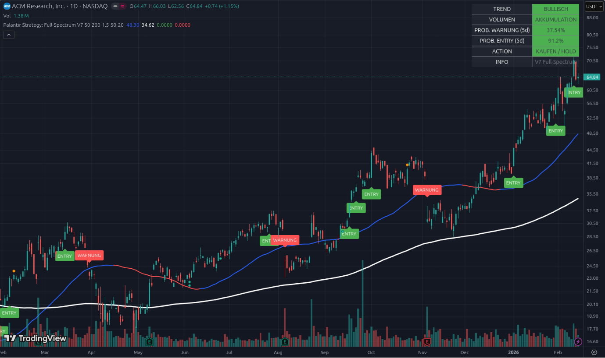

# 📘 Beispiel 1: Den „Explosion-Detector“ verstehen

### Aktie im Fokus: ACM Research (ACMR) | Stand: Februar 2026

Willkommen zu deiner ersten Analyse mit dem **V7 Full-Spectrum Guard**. Dieses Dokument erklärt dir Schritt für Schritt, was du auf deinem Bildschirm siehst, wie die Logik dahinter funktioniert und welche Handelsentscheidungen Profis daraus ableiten.

---

## 1. Die visuelle Landkarte (Was sehe ich im Chart?)

Schau dir die Linien und Symbole im Hauptfenster an:

*   **Die weiße Linie (SMA 200):** Das ist die „Demarkationslinie“. Aktien über dieser Linie befinden sich in einem langfristigen Bullenmarkt. ACMR ist weit über dieser Linie – das Fundament ist also extrem stark.
*   **Die blau/rote Linie (SMA 50):** Deine Momentum-Linie. Ist sie **Blau**, steigt die Aktie kurzfristig. Wird sie **Rot**, verliert sie Kraft. Aktuell ist sie tiefblau und zeigt steil nach oben.
*   **Grüne Labels (ENTRY):** Das sind die „Fußabdrücke“ der Strategie. Jedes Mal, wenn das Script ein ENTRY-Label gezeichnet hat, passten Ausbruch, Volumen und Gewinn zusammen. Du siehst: Wer beim letzten ENTRY bei ca. $58 eingestiegen ist, liegt bereits gut vorne.
*   **Rote Labels (WARNUNG):** Diese Punkte markieren Momente, in denen der Trend kurzzeitig wackelte. Sie dienten in der Vergangenheit als Schutz, um Gewinne nicht wieder abzugeben.

---

## 2. Das Dashboard: Dein Cockpit (Oben Rechts)

Das Dashboard übersetzt die Mathematik des Marktes in klare Farben und Zahlen. In deinem ACMR-Beispiel sehen wir ein **extrem seltenes „Full Green“ Szenario**:

### A. TREND: BULLISCH (Grün)
Die Richtung ist klar. Die Käufer kontrollieren das Geschehen. Es gibt keinen Grund, gegen diesen Trend zu wetten.

### B. VOLUMEN: AKKUMULATION (Grün)
Das ist der wichtigste Wert! Er bedeutet, dass bei steigenden Preisen massiv eingekauft wird. **Große Institutionen (Hedgefonds, Banken)** laden ihre Depots mit ACMR-Aktien voll. Das ist der „Treibstoff“ für die Explosion.

### C. PROB. ENTRY (5d): 91.2% (Grün) 🚀
Das Script berechnet hier die statistische Wahrscheinlichkeit für einen massiven Ausbruch in den nächsten 5 Tagen. 
*   **Warum ist der Wert so hoch?** Weil die Aktie direkt unter ihrem lokalen Höchststand klebt und die aktuelle Schwankungsbreite (Vola) so groß ist, dass ein „Überspringen“ des Widerstands fast sicher erscheint.

### D. PROB. WARNUNG (5d): 37.54% (Grün/Niedrig)
Das Risiko, dass die Aktie in den nächsten 5 Tagen tief unter die Unterstützung ($48.30) fällt, ist mathematisch gering. Die Absicherung nach unten steht.

---

## 3. Die Analyse: Warum sieht ACMR aus wie die "nächste Palantir"?

Wenn du dir den Verlauf ansiehst, erkennst du das Muster:
1.  **Seitwärtsphase:** Die Aktie konsolidiert (die Kerzen werden kleiner).
2.  **Akkumulation:** Das Volumen nimmt zu, während der Preis stabil bleibt oder leicht steigt.
3.  **Der Pivot:** Das Script erkennt den Ausbruch und gibt ein **ENTRY**-Signal (wie ganz rechts im Bild zu sehen).

Das Besondere hier: Die Wahrscheinlichkeit für den nächsten Schub liegt bei über **91 %**. Das ist ein statistischer „Slam Dunk“.

---

## 4. Konsequenzen: Was soll ich jetzt tun?

Basierend auf diesem Bild würde ein erfahrener Trader folgende Schritte ziehen:

1.  **Kauf-Entscheidung:** Das System zeigt „KAUFEN / HOLD“. Für Neueinsteiger ist dies ein Signal für eine **erste Position**. Da die Ausbruchs-Wahrscheinlichkeit so hoch ist, wartet man nicht mehr auf billigere Preise, sondern „springt auf den fahrenden Zug auf“.
2.  **Stop-Loss setzen:** Die Sicherheit liegt bei der blauen Linie ($48.30). Ein Stop-Loss sollte knapp darunter platziert werden, um das Risiko zu begrenzen.
3.  **Gewinne laufen lassen:** Solange das Feld **VOLUMEN** auf **AKKUMULATION** oder **STABIL** steht, wird kein Stück verkauft. Man lässt die „Explosion“ voll ausspielen.
4.  **Umschichtung (Roll-Over):** Wenn du noch Kapital in schwachen Aktien wie **SAP** oder **ServiceNow** (die im Dashboard wahrscheinlich „BÄRISCH“ und „ABVERKAUF“ zeigen) hast, ist ACMR genau das Ziel, in das du dieses Kapital jetzt umschichten solltest.

---

### Zusammenfassung für Einsteiger
ACMR zeigt aktuell **maximale Stärke**. Alle Ampeln (Trend, Volumen, Statistik) stehen auf Grün. Das System sagt dir: Die statistische Wahrscheinlichkeit ist auf deiner Seite. Der Weg des geringsten Widerstands führt nach oben.

---
*Hinweis: Dieses Dokument dient der Erläuterung des Tools. Entscheidungen triffst du eigenverantwortlich.*