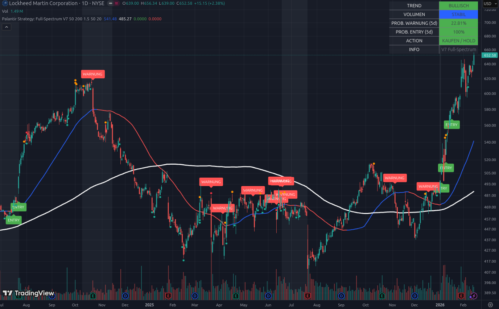

# 📘 Beispiel 10: Der Ausbruch des Giganten – Blue-Chip-Momentum

### Aktie im Fokus: Lockheed Martin (LMT) | Stand: 14. Februar 2026

Lockheed Martin zeigt im Februar 2026 eine Bilderbuch-Explosion. Dieses Beispiel ist wichtig, um zu verstehen, wie ein „schlafender Riese“ erwacht. Lange Zeit bewegte sich die Aktie seitwärts oder sogar abwärts, doch dann kam der Moment, in dem alle technischen und statistischen Faktoren auf „Zündung“ schalteten.

---

## 1. Die visuelle Analyse: Vom „Sorgenkind“ zum „Überflieger“

*   **Das Tal der Tränen (2025):** Schau dir die Mitte des Charts an. Das Script ist fast durchgehend **Rot**. Es gibt zahlreiche „WARNUNG“-Labels. Der Kurs lag lange Zeit unter der weißen Linie (SMA 200). In dieser Phase gab es kein Geld zu verdienen – das Tool hat dich hier konsequent geschützt.
*   **Der Wendepunkt:** Ende 2025 durchbrach der Kurs die weiße Linie ($485.27) von unten nach oben. Kurz darauf folgten die ersten grünen **ENTRY**-Labels.
*   **Die aktuelle Explosion:** Ab Januar 2026 gab es kein Halten mehr. Die Aktie schoss von ca. $480 auf aktuell **$652.58**. Beachte, wie steil die blaue Momentum-Linie ($541.48) nach oben zeigt.

---

## 2. Das Dashboard: Maximale Zuversicht

Trotz des bereits massiven Anstiegs zeigt das Dashboard Werte, die man selten bei einem so großen Unternehmen sieht:

### A. PROB. ENTRY (5d): 100% (Grün) 🚀
*   Das ist die höchste Stufe der statistischen Wahrscheinlichkeit. 
*   **Warum 100%?** Die Aktie befindet sich in einem „Blue Sky“-Szenario. Sie bildet fast jeden Tag neue Allzeithochs. Die Volatilität ist so positiv ausgerichtet, dass das Tool statistisch keinen Widerstand mehr berechnen kann, der einen weiteren Anstieg in der nächsten Woche verhindern würde.

### B. PROB. WARNUNG (5d): 22.81% (Grün/Sehr Niedrig)
*   Das Risiko eines Absturzes ist minimal. Der Abstand zur blauen Linie ($541) ist zwar groß, aber die Aufwärts-Dynamik ist so stark, dass ein plötzlicher Fall unter diesen Support statistisch extrem unwahrscheinlich ist.

### C. VOLUMEN: STABIL (Blau) 🔵
*   Das ist das „Qualitäts-Signal“. Obwohl die Aktie massiv steigt, sehen wir keinen hysterischen Kaufrausch (der oft ein Ende ankündigt), sondern ein gesundes, stetiges Volumen. Die Institutionen kaufen Lockheed Martin kontrolliert auf dem Weg nach oben ein.

---

## 3. Die Analyse: Warum ist LMT die „Sicherheits-Explosion“?

Im Gegensatz zu volatilen Halbleitern (ACMR) oder Biotechs (CPRX) bietet Lockheed Martin eine **fundamentale Sicherheit**. 
*   Das Tool zeigt uns hier den Moment, in dem eine Aktie von einer „Value-Aktie“ (langweilig) zu einer „Growth-Aktie“ (explosiv) wird.
*   Das **ENTRY**-Label bei ca. $560 war der letzte technische Startschuss. Wer dort eingestiegen ist, sitzt jetzt auf einem massiven Gewinn bei einem sehr geringen Risiko.

---

## 4. Konsequenzen: Was bedeutet das für dein Portfolio?

Lockheed Martin ist der ideale **Anker-Satellit**:

1.  **Laufen lassen (HOLD):** Das Dashboard zeigt unmissverständlich **„KAUFEN / HOLD“**. Es gibt absolut kein Anzeichen für eine Trendwende. Hier gilt die Regel: „Gewinne laufen lassen, solange das Dashboard Grün zeigt.“
2.  **Sektor-Rotation:** Während Software (SAP/MSFT) schwächelt, zeigt Lockheed Martin, wo das Geld der großen Fonds hinfließt: In Verteidigung, Sicherheit und reale Infrastruktur.
3.  **Kein FOMO-Kauf bei 100%:** Auch wenn die Entry-Wahrscheinlichkeit bei 100% liegt, ist die Aktie kurzfristig weit von der blauen Linie entfernt. Ein Profi kauft hier nicht mit der ganzen Summe nach, sondern hält die bestehende Position oder wartet auf einen kleinen Rücksetzer (Dip) zur blauen Linie.

---

### Zusammenfassung für Einsteiger
Lockheed Martin ist der Beweis, dass unsere Strategie auch bei den größten Firmen der Welt funktioniert. Das Tool hat den Wechsel von „Bärisch“ zu „Bullisch“ perfekt antizipiert.

**Das Tool sagt dir:** „Lockheed Martin hat seine Fesseln abgeworfen. Die statistische Wahrscheinlichkeit für weitere Hochs ist bei 100%. Dies ist aktuell einer der sichersten und stärksten Trends in deinem gesamten Scan. Bleib an Bord!“

---
*Hinweis: Blue-Chip-Explosionen sind oft langlebiger als Tech-Hypes. Nutze die 22%ige Warn-Wahrscheinlichkeit als Bestätigung für deine Gelassenheit.*