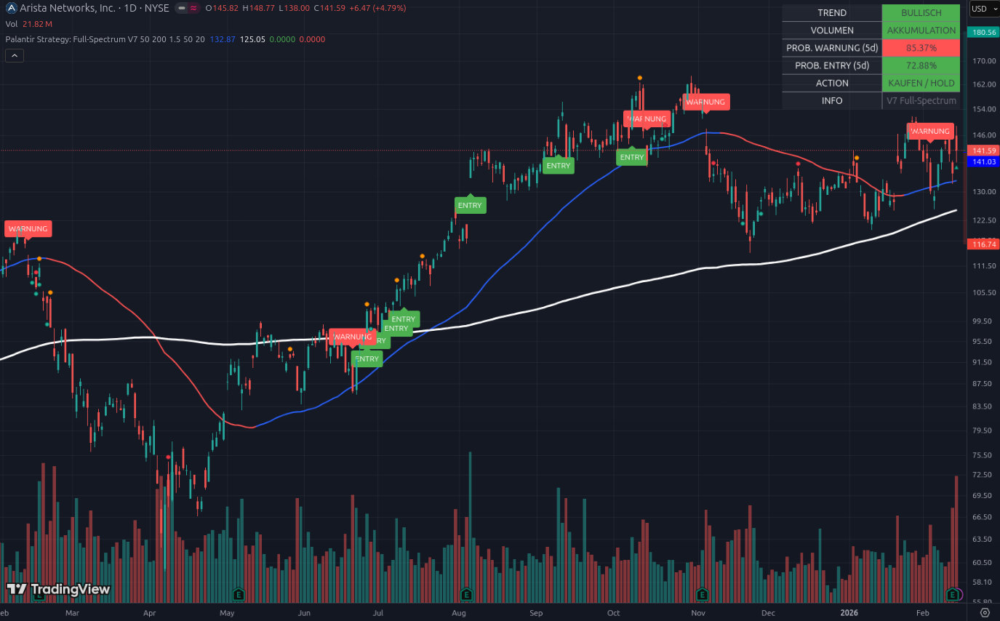

# 📘 Beispiel 2: Die „Belastungsprobe“ meistern

### Aktie im Fokus: Arista Networks (ANET) | Stand: Februar 2026

Während ACMR (Beispiel 1) ein klarer „Durchstarter“ ist, zeigt Arista Networks (ANET) ein komplexeres Bild. Dieses Beispiel lehrt dich, wie du das Tool nutzt, um in unruhigen Marktphasen kühlen Kopf zu bewahren.

---

## 1. Die Situation: „Der Kampf an der Linie“

Schau dir den aktuellen Kursverlauf ganz rechts im Chart an:

*   **Das rote Label (WARNUNG):** Das Script hat gerade ein Warnsignal ausgegeben. Warum? Weil Arista unter die blaue 50-Tage-Linie gefallen war. Technisch gesehen ist das ein Moment der Schwäche.
*   **Die Erholung:** Du siehst jedoch eine starke grüne Kerze (+4,79 %), die den Kurs sofort wieder nach oben zieht. Die Käufer lassen Arista nicht fallen.
*   **Die weiße Linie (SMA 200):** Beachte, wie weit Arista noch über der weißen Linie steht. Der langfristige Trend ist also völlig ungefährdet.

---

## 2. Das Dashboard: Widersprüche richtig deuten

Das Dashboard zeigt hier eine sehr spannende Konstellation:

### A. VOLUMEN: AKKUMULATION (Grün) 🟢
Das ist die wichtigste Information in diesem Chart! Obwohl der Preis gewackelt hat, zeigt das Volumen „AKKUMULATION“. Das bedeutet: **Die Profis nutzen den Rücksetzer, um massiv nachzukaufen.** Wenn das Volumen rot wäre (Abverkauf), müssten wir fliehen. Da es grün ist, bleiben wir ruhig.

### B. PROB. WARNUNG (5d): 85.37% (Rot) ⚠️
Warum ist dieser Wert so hoch?
*   Die Mathematik sieht, dass der Kurs sehr nah an der blauen Unterstützungslinie ($132.87) klebt. 
*   Ein kleiner Stoß nach unten reicht aus, um den Trend technisch zu brechen. Das Tool warnt dich: „Die See ist hier sehr unruhig, ein Absturz unter den Support ist statistisch wahrscheinlich.“

### C. PROB. ENTRY (5d): 72.88% (Grün)
Gleichzeitig ist die Chance auf einen Ausbruch nach oben ebenfalls hoch. Wir haben hier eine **„Alles-oder-Nichts“-Situation**. Die Aktie wird sich in den nächsten 5 Tagen wahrscheinlich massiv in die eine oder die andere Richtung bewegen.

---

## 3. Die Analyse: Warum zeigt die ACTION „KAUFEN / HOLD“?

Trotz der hohen Warn-Wahrscheinlichkeit sagt das Tool „KAUFEN / HOLD“. Warum?
1.  **Fundamental-Check:** Arista verdient fast eine Milliarde Dollar (955,8 Mio. $). Das ist ein „Quality Leader“.
2.  **Trend-Stärke:** Die blaue Linie (Trend) zeigt im Hintergrund immer noch nach oben.
3.  **V-Erholung:** Die Tatsache, dass die Aktie sofort nach dem Eintunken unter die Linie wieder hochgekauft wurde (Akkumulation), ist ein Zeichen extremer Stärke.

---

## 4. Konsequenzen: Wie handelst du das?

Dieses Bild erfordert eine **taktische Vorgehensweise**:

1.  **Keine Panikverkäufe:** Das Tool bestätigt durch „AKKUMULATION“, dass das große Geld nicht wegläuft. Ein Ausstieg wäre verfrüht.
2.  **Die 26. Februar-Falle:** Da Arista am Super-Donnerstag (Zahlen von ACMR/CPRX) wahrscheinlich mitgerissen wird, ist dies die entscheidende Phase. 
3.  **Die Strategie:** 
    *   Wenn du drin bist: **Halten.** Setze einen harten Stop-Loss bei der 200-Tage-Linie (weiß), um dich gegen einen Systemcrash abzusichern.
    *   Wenn du neu einsteigen willst: Warte, bis die **„Prob. Warnung“ unter 40 % fällt**. Das passiert, sobald Arista sich wieder deutlicher von der blauen Linie nach oben absetzt.
4.  **Umschichtung von SAP:** Da Arista im Gegensatz zu SAP sofort wieder hochgekauft wird (Relative Stärke), ist dies immer noch ein exzellenter Platz für dein Kapital, auch wenn es gerade „ruckelt“.

---

### Zusammenfassung für Einsteiger
ANET ist momentan wie ein Flugzeug in Turbulenzen. Die Warnleuchten blinken (**Prob. Warnung 85 %**), aber die Triebwerke sind voll funktionsfähig (**Akkumulation**) und die Flughöhe ist sicher (**über SMA 200**). 

**Das Tool sagt dir:** „Schnall dich an, bleib an Bord, aber sei bereit, falls das Wetter am 26.02. umschlägt.“

---
*Hinweis: Dieses Dokument dient der Erläuterung der Tool-Logik bei hoher Volatilität.*