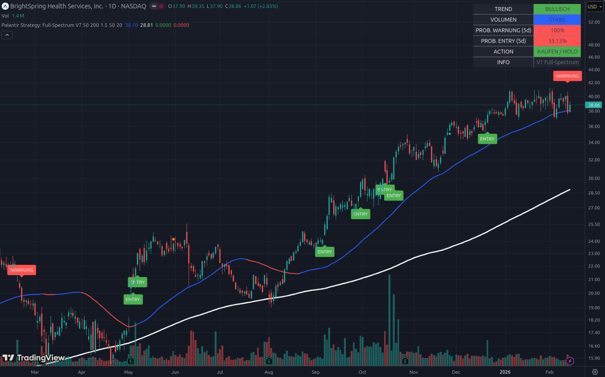

# 📘 Beispiel 3: Die „100 % Warnung“ – Panik oder Chance?

### Aktie im Fokus: BrightSpring Health (BTSG) | Stand: Februar 2026

Dieses Beispiel ist das ultimative Training für deine Disziplin. Es zeigt eine Aktie, die technisch „angeschlagen“ ist, aber laut System immer noch das Potenzial zur Explosion hat.

---

## 1. Die Situation: „Eingetaucht in die Gefahrenzone“

Schau dir den Kursverlauf am rechten Rand an:

*   **Das rote Label (WARNUNG):** Das Script hat ein Warnsignal generiert, weil der Kurs unter die blaue 50-Tage-Linie gefallen ist.
*   **Der Kursstand:** Mit $38,86 kämpft die Aktie exakt an der Unterstützungslinie. Sie ist „eingetaucht“.
*   **Historischer Rückblick:** Schau nach links im Chart (August/September). Du siehst, dass BTSG das schon einmal gemacht hat: kurz unter die Linie gefallen, Warnung kassiert, nur um dann massiv nach oben zu explodieren.

---

## 2. Das Dashboard: Die nackte Wahrheit

Hier wird es mathematisch spannend. Warum zeigt das Dashboard so extreme Werte?

### A. PROB. WARNUNG (5d): 100% (Rot) ❗
Das sieht bedrohlich aus, ist aber eine logische Folge der Mathematik:
*   Das Tool berechnet: „Wie wahrscheinlich ist es, dass wir in 5 Tagen unter der blauen Linie sind?“ 
*   Da der Kurs **bereits jetzt** die Linie berührt oder leicht darunter liegt, meldet die Statistik: „Wahrscheinlichkeit erfüllt = 100 %“. 
*   **Die Lektion:** 100 % Warnung bedeutet nicht, dass die Aktie auf Null fällt, sondern dass der **technische Schutzschirm (SMA 50) aktuell durchbrochen ist**.

### B. TREND: BULLISCH (Grün) 📈
Trotz der 100 % Warnung bleibt der Trend-Status „BULLISCH“. Warum?
*   Die blaue Linie selbst zeigt immer noch steil nach oben.
*   Das System sagt: „Ja, wir haben ein kurzfristiges Problem, aber die übergeordnete Richtung der letzten Monate ist immer noch klar aufwärts.“

### C. VOLUMEN: STABIL (Blau)
Es gibt keinen massiven Abverkauf. Die Leute werfen die Aktie nicht panisch weg (sonst wäre das Feld Rot / „ABVERKAUF“). Es ist eher ein vorsichtiges „Luft holen“.

---

## 3. Die Analyse: Warum zeigt die ACTION immer noch „KAUFEN / HOLD“?

Das ist der entscheidende Punkt der **Palantir-Strategie**:
Das System schützt dich davor, in einer gesunden Korrektur ausgestoppt zu werden. Solange die Aktie weit über der **weißen 200-Tage-Linie ($28,81)** steht, ist das „Haus“ noch stabil. Nur das „Fenster“ (SMA 50) ist kurz offen.

---

## 4. Konsequenzen: Wie reagierst du hier?

Ein Profi zieht aus diesem Bild folgende Konsequenzen:

1.  **Keine Neukäufe:** Bei einer 100 % Warnung und nur 35 % Entry-Wahrscheinlichkeit kaufst du nicht nach. Du wartest, bis die Gefahr vorüber ist.
2.  **Geduld beim Halten:** Wenn du die Aktie bereits besitzt, bleibst du investiert, solange das Dashboard „HOLD“ zeigt. Du akzeptierst das „Rauschen“.
3.  **Das „Re-Entry“ Signal:** Achte auf die nächsten Tage. Sobald BTSG wieder über die blaue Linie steigt, wird die Warn-Wahrscheinlichkeit schlagartig sinken und ein neues **ENTRY-Label** wird erscheinen. **Das ist der Moment, in dem die nächste Raketenstufe zündet.**
4.  **Der Vergleich zu SAP:** Während SAP im Dashboard wahrscheinlich „BÄRISCH“ und „FINGER WEG“ zeigt (weil die Linien nach unten zeigen), ist BTSG nur in einer „Verschnaufpause“.

---

### Zusammenfassung für Einsteiger
BTSG zeigt eine **technische Schwäche innerhalb eines starken Aufwärtstrends**. Die „100 % Warnung“ ist eine Information über den *Zustand* (wir sind unter der Linie), nicht über das *Ende* der Aktie.

**Das Tool sagt dir:** „Wir sind im Grenzbereich. Es ist riskant, aber der Trend ist noch dein Freund. Warte auf die Rückkehr über die $40-Marke, dann ist die Explosion wieder auf Kurs.“

---
*Hinweis: Dieses Beispiel zeigt, wie man statistische Extremwerte (100 %) ohne Panik interpretiert.*