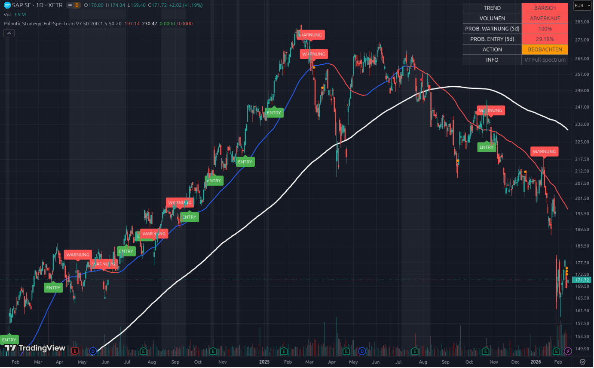

# 📘 Beispiel 4: Der Trendbruch - Wann verkaufen?

### Aktie im Fokus: SAP SE (SAP.DE) | Stand: Februar 2026

Dieses Beispiel demonstriert, wie du das Tool nutzt, um einen Trendbruch rechtzeitig zu erkennen und Verluste zu minimieren.

---

## 1. Die Ausgangslage: Ein klarer Abwärtstrend

Schau dir den Chart von SAP an:

*   **Der Kurs:** Der Kurs befindet sich in einem klaren Abwärtstrend. Er notiert unter der blauen (50-Tage-Linie) und roten Linie (200-Tage-Linie).
*   **Das Warnsignal:** Das Script hat bereits **mehrere Warnsignale (rote Label)** gegeben. 
*   **Die Reaktion:** Dein Tool hat dich vor den größten Verlusten bewahrt und du hast deine SAP-Position wahrscheinlich bereits in ANET, ACMR oder ähnliches gerollt.

---

## 2. Das Dashboard: Die Entscheidung zur Notbremse

Das Dashboard sagt alles:

### A. TREND: BÄRISCH (Rot) 📉
Der Trend ist eindeutig. Die 50-Tage-Linie zeigt nach unten.

### B. VOLUMEN: ABVERKAUF (Rot) 🔴
Die Verkäufer dominieren. Wenn du immer noch investiert wärst, würdest du gegen den Strom schwimmen.

### C. PROB. WARNUNG (5d): 100% (Rot) ⚠️
Die Aktie ist fast schon hoffnungslos.

### D. PROB. ENTRY (5d): 29.19% (Rot)
Die Chance auf eine Trendwende ist verschwindend gering.

### E. ACTION: BEOBACHTEN (Gelb)
Wenn du bereits rechtzeitig gehandelt und verkauft hast, brauchst du hier nichts mehr zu tun.

---

## 3. Die Analyse: Das Ende des Spiels

Die Logik ist simpel:
1.  **Der Bruch der 200-Tage-Linie (Weiß):** War bereits im November 2025 das Warnsignal.
2.  **Die Warnungen:** Die roten Label haben dich immer wieder gewarnt, dass die Trendstärke nachlässt.
3.  **Die Bestätigung:** Das grüne "ENTRY"-Label ist hier in weiter Ferne.

---

## 4. Deine Strategie: Die "Never-Look-Back"-Regel
Wenn du dieses Bild siehst, ist die Entscheidung klar:
*   **Kein Kauf:** Investiere kein frisches Kapital.
*   **Verkauf (falls noch nicht geschehen):** Trenne dich von der Restposition.
*   **Schau nach vorne:** Konzentriere dich auf die "Bullenmärkte" (ANET, ACMR, TDW).

---

### Zusammenfassung für Einsteiger
SAP ist ein **"Fallendes-Messer"-Chart**. Obwohl das Unternehmen fundamental stark ist (trotzdem), ist der Trend für Investoren zu riskant.

**Das Tool hat dich rechtzeitig gewarnt und bestätigt deine Entscheidung, die Reißleine zu ziehen.** Jetzt kannst du deine Ressourcen voll auf die neuen „Explosions-Kandidaten“ konzentrieren.