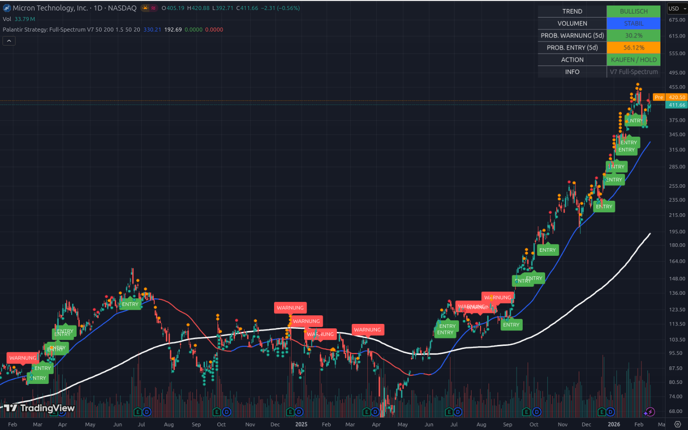

# 📘 Beispiel 5: Der Ritt auf der Rakete

### Aktie im Fokus: Micron Technology (MU) | Stand: Februar 2026

Micron zeigt uns, was passiert, wenn die „Palantir-Explosion“ voll gezündet hat. Die Aktie hat sich von einer Seitwärtsphase ($80 - $120) in einen vertikalen Anstieg verwandelt. Dieses Beispiel zeigt dir, wie das Tool einen extremen Trend bewertet.

---

## 1. Die visuelle Analyse: Von der „Base“ zur „Stratosphäre“

*   **Die Historie der Signale:** Schau dir den Bereich von Juni bis Oktober 2025 an. Das Script hat dort eine ganze Serie von **ENTRY-Labels** generiert. Es hat erkannt, dass die Aktie jedes Mal, wenn sie kurz pausierte, sofort wieder von Institutionen gekauft wurde.
*   **Der vertikale Anstieg:** Der Kurs ist von ca. $140 auf über $411 gestiegen. 
*   **Abstand zu den Linien:** Beachte den riesigen Abstand zur weißen Linie (SMA 200). Das ist ein Zeichen für extreme Stärke, aber auch für eine „Überhitzung“.
*   **Die Momentum-Linie (Blau):** Die Aktie „reitet“ förmlich auf der blauen Linie. Jedes Mal, wenn sie diese berührt, springt sie wieder nach oben.

---

## 2. Das Dashboard: Profi-Daten für extreme Trends

Obwohl die Aktie schon massiv gestiegen ist, bleibt das Dashboard optimistisch, aber wachsam:

### A. TREND: BULLISCH (Grün) 🟢
Solange die blaue Linie so steil nach oben zeigt, gibt es technisch keinen Grund zu verkaufen. Der Trend ist dein Freund.

### B. VOLUMEN: STABIL (Blau)
Das ist interessant: Trotz des hohen Preises gibt es keinen „ABVERKAUF“. Das Volumen ist nicht panisch. Die Anleger halten ihre Stücke fest. Das ist ein sehr gutes Zeichen für die Nachhaltigkeit des Trends.

### C. PROB. ENTRY (5d): 56.12% (Gelb/Grün)
Die Wahrscheinlichkeit für einen *weiteren* Ausbruch in den nächsten 5 Tagen ist moderat positiv. Die Aktie macht gerade eine kleine Pause am Allzeithoch ($420). 

### D. PROB. WARNUNG (5d): 30.2% (Grün/Niedrig)
Obwohl der Kurs hoch ist, ist das Risiko eines sofortigen Absturzes unter die blaue Linie ($330) aktuell gering. Warum? Weil die Volatilität der letzten Tage abgenommen hat (Konsolidierung auf hohem Niveau).

---

## 3. Die Analyse: „Hold the Line“

Das System zeigt **ACTION: KAUFEN / HOLD**. 
*   Für jemanden, der unten eingestiegen ist (bei den ersten ENTRY-Labels), bedeutet das: **Nichts tun, Gewinne laufen lassen.**
*   Das Tool schützt dich hier vor dem größten Fehler an der Börse: **Zu früh zu verkaufen**, nur weil man „Angst vor der Höhe“ hat. Solange das Volumen nicht auf Rot springt, bleibt man an Bord.

---

## 4. Konsequenzen: Dein taktischer Plan

Micron dient in deinem Depot als das „Mutterschiff“ im Halbleitersektor. So handelst du dieses Bild:

1.  **Gewinne laufen lassen:** Die „Palantir-Strategie“ zielt auf die Vervielfachung ab. Micron liefert genau das. Kein Verkaufssignal in Sicht.
2.  **Der „Roll-Over“ Check:** Erinnere dich an dein Vorhaben: „Teile von Micron in ACMR rollen“. 
    *   **Micron (hier):** Prob. Entry 56 %.
    *   **ACMR (Beispiel 1):** Prob. Entry 91 %.
    *   **Konsequenz:** Es macht strategisch Sinn, einen Teil der Gewinne von der „satten“ Micron in die „hungrige“ ACMR zu schieben, da dort die Ausbruchswahrscheinlichkeit aktuell fast doppelt so hoch ist.
3.  **Sicherheit:** Dein Stop-Loss sollte jetzt mindestens auf dem Niveau der blauen Linie ($330) liegen, um den massiven Buchgewinn abzusichern.

---

### Zusammenfassung für Einsteiger
Micron ist das Paradebeispiel für eine **Trendfolge-Aktie**. Das Tool zeigt dir, dass eine Aktie auch nach 300 % Kursplus noch ein „KAUFEN / HOLD“ sein kann, solange der institutionelle Support (Volumen) stimmt.

**Das Tool sagt dir:** „Die Rakete ist weit oben, aber die Triebwerke laufen ruhig. Es gibt keine Anzeichen für eine Notlandung. Genieße den Flug, aber behalte ACMR für den nächsten Start im Auge.“

---
*Hinweis: Parabolische Trends wie bei Micron erfordern Disziplin beim Stop-Loss, da Rücksetzer heftig ausfallen können.*