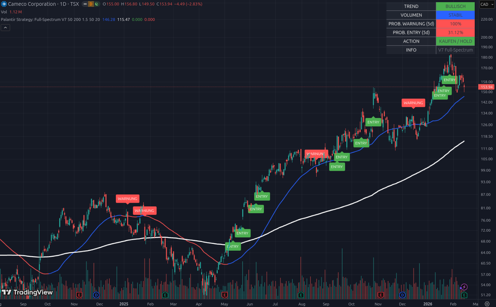

# 📘 Beispiel 6: Der „Hard Asset“-Leader am Scheideweg

### Aktie im Fokus: Cameco Corp (CCJ) | Stand: Februar 2026

Cameco ist das perfekte Beispiel für eine Aktie, die von einer fundamentalen Makro-Story getrieben wird (KI-Rechenzentren brauchen Atomstrom). Der Chart zeigt eine beeindruckende Serie von Gewinnen, steht aber aktuell vor einem kritischen Test der Unterstützung.

---

## 1. Die visuelle Analyse: Die „Treppe“ nach oben

*   **Die Serie der ENTRY-Labels:** Schau dir den Verlauf seit Mai 2025 an. Das Script hat fast jeden bedeutenden Rücksetzer als Kaufgelegenheit erkannt. Wer der Strategie gefolgt ist, hat den Anstieg von ca. **$65 auf über $180** fast komplett mitgenommen.
*   **Der aktuelle Rücksetzer:** Der Kurs ist von seinem Allzeithoch bei ca. $185 auf **$153.94** zurückgefallen.
*   **Der gleitende Durchschnitt (Weiß):** Die 200-Tage-Linie liegt bei **$115.47**. Das bedeutet: Selbst nach dem aktuellen Kurssturz ist Cameco immer noch in einem extrem starken, langfristigen Bullenmarkt. Der „Puffer“ zur Sicherheitslinie ist gewaltig.

---

## 2. Das Dashboard: Ein klassischer „Trend-Stresstest“

Das Dashboard zeigt uns genau, warum Cameco gerade „schwitzt“, aber noch nicht „stirbt“:

### A. PROB. WARNUNG (5d): 100% (Rot) ❗
Wie schon bei Beispiel 3 (BTSG) bedeutet der Wert von 100%:
*   Die Aktie hat die blaue 50-Tage-Linie ($146.28) bereits berührt oder leicht unterschritten.
*   **Die Bedeutung:** Technisch gesehen ist der „kurzfristige Schutzschild“ durchbrochen. Das Tool registriert diesen Zustand sofort als maximale Warnung für die kommenden 5 Tage.

### B. VOLUMEN: STABIL (Blau) 🔵
Das ist das wichtigste Signal für dich als Investor: Trotz des Kursrückgangs gibt es **keinen massiven Abverkauf**. Die Volumensäulen am unteren Rand sind unauffällig.
*   **Die Lektion:** Das „große Geld“ (Fonds/Institutionen) verlässt Cameco nicht panisch. Es sind eher kurzfristige Gewinnmitnahmen nach einem gigantischen Lauf.

### C. PROB. ENTRY (5d): 31.12% (Rot/Niedrig)
Das Tool sagt dir klar: „Erwarte in der nächsten Woche keinen neuen Rekordflug.“ Die Aktie muss den Sturz erst verdauen und eine neue „Base“ (graue Zone) bilden, bevor die Reise weitergeht.

---

## 3. Die Analyse: „Uran ist die neue Software“

Das System zeigt **ACTION: KAUFEN / HOLD**. 
Warum verkaufen wir nicht alles bei einer 100% Warnung?
1.  **Fundamental-Check:** Uran ist knapp, die Nachfrage durch Big Tech (MSFT, AMZN) nach CO2-freiem Strom ist real.
2.  **Trend-Stärke:** Die blaue Linie zeigt immer noch nach oben (**BULLISCH**). Der Trend ist noch nicht gebrochen, er wird nur getestet.

---

## 4. Konsequenzen: Deine taktische Entscheidung

Du hast überlegt, CCJ zu „opfern“, um in **TDW** (Energie-Hebel) oder **ACMR** (Halbleiter-Wäsche) zu rollen. Dieser Chart gibt dir die perfekte Entscheidungsgrundlage:

1.  **Gewinne sichern (Teil-Exit):** Da die **Prob. Warning bei 100%** liegt und die **Prob. Entry nur bei 31%**, wird CCJ in den nächsten Tagen wahrscheinlich seitwärts laufen oder leicht schwächeln. Dies ist ein **idealer technischer Zeitpunkt**, um einen Teil der Gewinne (z.B. 30-50%) steuerlich klug zu realisieren.
2.  **Das Kapital rollen:** Das frei gewordene Kapital kannst du nun in Werte stecken, die im Dashboard eine **Prob. Entry von >70%** zeigen (wie wir es bei ACMR gesehen haben). 
3.  **Den „Kern“ behalten:** Da Cameco dein stärkster „Hard Asset“ Hedge ist, behalte den Rest der Position. Das Dashboard erlaubt dir das Halten („HOLD“), solange die weiße Linie nicht in Gefahr gerät.

---

### Zusammenfassung für Einsteiger
Cameco macht gerade eine **„Pause auf hohem Niveau“**. Die 100% Warnung zeigt, dass das Momentum kurzzeitig unterbrochen ist. 

**Das Tool sagt dir:** „Keine Panik, Cameco ist immer noch ein Champion. Aber wenn du Geld für neue Raketenstarts (ACMR/TDW) brauchst, ist jetzt der Moment gekommen, bei Cameco ein wenig ‚vom Tisch zu nehmen‘, da der nächste Ausbruch hier erst einmal auf sich warten lässt.“

---
*Hinweis: Rohstoff-Aktien wie CCJ können volatil sein. Nutze die stabilen Volumen-Daten des Dashboards, um echtes Verkaufsinteresse von bloßem Marktrauschen zu unterscheiden.*