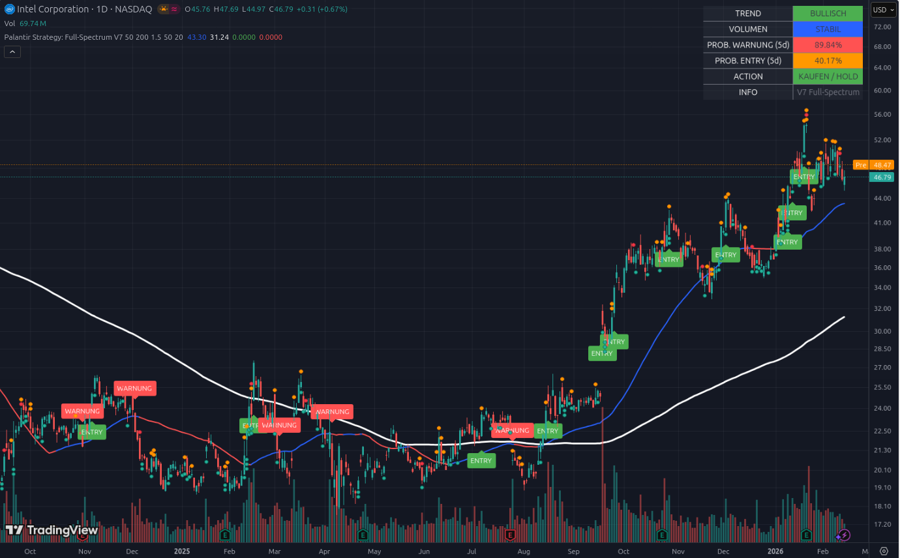

# 📘 Beispiel 7: Die Anatomie des Turnarounds

### Aktie im Fokus: Intel Corp (INTC) | Stand: Februar 2026

Intel ist das Paradebeispiel für die **„Palantir-Strategie“ bei einem Turnaround-Wert**. Lange Zeit als „totes Kapital“ abgeschrieben, hat Intel durch seine Foundry-Sparte (Chip-Fertigung für Dritte) und den technologischen Sprung (18A-Prozess) das Ruder herumgerissen. Das Tool zeigt uns hier, wie aus einer depressiven Seitwärtsphase eine neue Wachstumsstory wird.

---

## 1. Die visuelle Analyse: Der „Ausbruch aus dem Tal der Tränen“

*   **Der Phasenwechsel:** Schau dir das Jahr 2025 an. Die weiße Linie (SMA 200) zeigte steil nach unten. Das Script generierte in dieser Zeit viele **„WARNUNG“**-Labels. Ein Profi hätte hier niemals gekauft.
*   **Die Bodenbildung:** Zwischen Juni und August 2025 bildete Intel eine breite „Base“ (Boden).
*   **Der Zündmoment:** Ab September 2025 siehst du eine dichte Kette von **„ENTRY“**-Labels. Hier hat das System erkannt: 
    1. Der Kurs hat die weiße Linie (SMA 200) von unten nach oben durchbrochen.
    2. Die blaue Linie (SMA 50) zeigt steil nach oben.
    *   Wer hier eingestiegen ist (bei ca. $28), sieht die Aktie nun bei **$46.79**. Das ist fast eine Verdopplung.

---

## 2. Das Dashboard: Kurze Verschnaufpause im Bullenmarkt

Das Dashboard zeigt uns eine Aktie, die nach einem gewaltigen Lauf gerade „Luft holt“:

### A. PROB. WARNUNG (5d): 89.84% (Orange) ⚠️
Dies ist ein klassisches Warnsignal für kurzfristige Trader:
*   Der Kurs ist von seinem Hoch ($56) zurückgekommen.
*   Da die Volatilität der letzten Tage hoch war, berechnet das Tool eine **90%ige Wahrscheinlichkeit**, dass Intel in den nächsten 5 Tagen die blaue Linie ($43.30) berührt oder testet.
*   **Die Bedeutung:** Kein Grund zur Panik, aber ein Zeichen, dass die Aktie kurzfristig „überkauft“ war und nun korrigiert.

### B. TREND: BULLISCH (Grün) 🟢
Trotz des Rücksetzers zeigt die blaue Momentum-Linie steil nach oben. Das System sagt: „Der übergeordnete Trend ist extrem stark. Dies ist nur ein Rücksetzer im Aufwärtstrend.“

### C. VOLUMEN: STABIL (Blau) 🔵
Es gibt keine Anzeichen für massiven institutionellen Ausstieg. Das Volumen bleibt im Rahmen. Die großen Player halten ihre Intel-Aktien fest, weil sie auf die langfristige Foundry-Story setzen.

---

## 3. Die Analyse: „Der Elefant lernt Ballett“

Die Logik hinter Intel ist fundamental: 
*   Intel hat sich von einem reinen Chip-Designer zu einem **Infrastruktur-Player** (wie TSMC) transformiert. 
*   Das Tool hat diesen fundamentalen Wandel technisch bereits im Herbst 2025 durch die „ENTRY“-Signale bestätigt. 
*   Aktuell ist Intel in einer Phase, in der sie ihre Gewinne konsolidiert.

---

## 4. Konsequenzen: Deine taktische Entscheidung

Du hast Intel als deinen „Turnaround-Joker“ im Depot. So nutzt du dieses Bild:

1.  **Nicht verkaufen (HOLD):** Das Dashboard zeigt **„KAUFEN / HOLD“**. Solange Intel über der weißen Linie ($31.24) und im Idealfall über der blauen Linie ($43.30) bleibt, ist die Story intakt.
2.  **„Buy the Dip“ (Nachkaufchance):** Da die **Prob. Warning bei 90%** liegt, ist die Wahrscheinlichkeit hoch, dass Intel noch einmal in den Bereich von **$43 - $44** eintaucht. Für jemanden, der noch nicht investiert ist, wäre das die perfekte Gelegenheit, Intel „günstig“ einzusammeln, bevor die nächste Welle startet.
3.  **Geduld:** Intel ist kein „Schnellschuss“ wie eine kleine Biotech-Firma. Es ist eine Wette auf die technologische Souveränität der USA. Das Tool zeigt dir, dass der langfristige Trend gerade erst begonnen hat.

---

### Zusammenfassung für Einsteiger
Intel zeigt uns, wie ein **erfolgreicher Richtungswechsel** aussieht. Aus einer Aktie, die niemand haben wollte (Bärenmarkt), wurde eine Aktie, die nun Rücksetzer kauft (Bullenmarkt).

**Das Tool sagt dir:** „Intel macht gerade eine Pause nach einem Sprint. Die 90% Warnung ist kein Grund zum Ausstieg, sondern eine Einladung, bei $43 genauer hinzuschauen. Der Elefant tanzt weiter.“

---
*Hinweis: Turnaround-Wetten erfordern Sitzfleisch. Nutze das Dashboard, um dich nicht von kurzfristigen Schlagzeilen verunsichern zu lassen, solange die 'TREND'-Anzeige grün bleibt.*