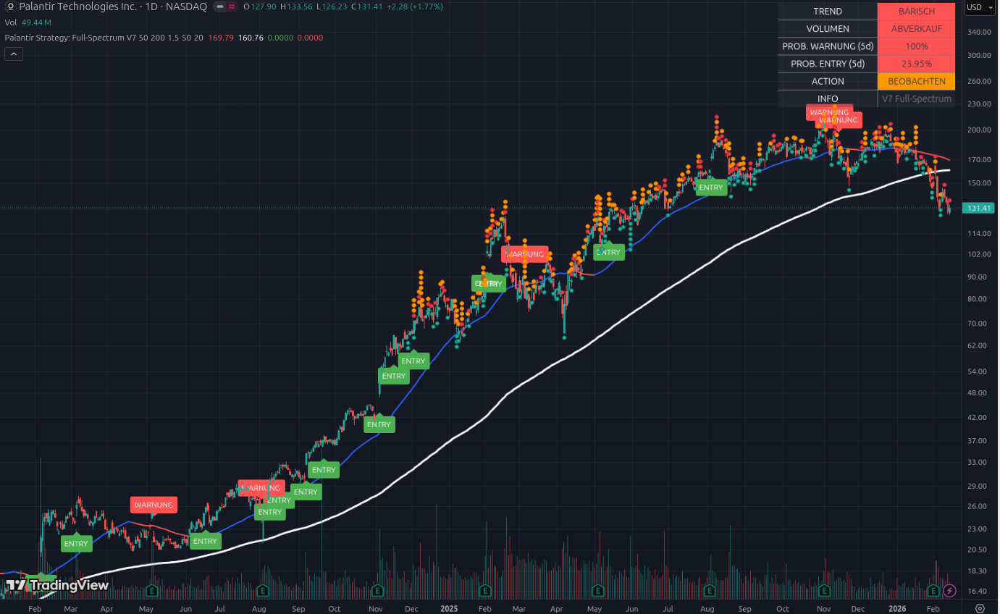

# 📘 Beispiel 8: Wenn der König wankt – Das Ende eines Zyklus

### Aktie im Fokus: Palantir (PLTR) | Stand: Februar 2026

Palantir ist die Inspiration für unser gesamtes Tool. Wer die Signale dieses Scripts genutzt hat, konnte den legendären Aufstieg von **$16 auf über $200** mitmachen. Doch der aktuelle Chart zeigt uns die brutalste Lektion der Börse: Nichts steigt ewig. Hier lernst du, wie das Tool dich davor bewahrt, Gewinne einer jahrelangen Rallye in wenigen Wochen wieder zu verlieren.

---

## 1. Die visuelle Analyse: Der „Sturz aus dem Olymp“

*   **Der goldene Pfad (Links bis Mitte):** Schau dir die unglaubliche Kette von **„ENTRY“**-Labels an. Seit Anfang 2024 hat das System fast jeden Ausbruch korrekt identifiziert. Palantir war das „Poster-Child“ für institutionelle Akkumulation.
*   **Der Bruch der weißen Linie (SMA 200):** Das ist der kritische Moment. Die weiße Linie ($160.76) ist die letzte Verteidigungslinie der Bullen. Der Kurs ist wie ein Stein durch diese Linie gefallen. 
*   **Der Status Quo:** Mit **$131.41** notiert Palantir nun tief im „Bären-Territorium“. Die blaue Momentum-Linie ist rot geworden und zeigt steil nach unten.

---

## 2. Das Dashboard: Die harte „Hyper-Truth“

Das Dashboard zeigt uns das Bild einer Aktie, die gerade massiv von Institutionen verlassen wird:

### A. TREND: BÄRISCH (Rot) 🔴
Das Momentum ist komplett gekippt. Die 50-Tage-Linie fällt. Es gibt keine technische Unterstützung mehr, die den Fall gerade aufhält.

### B. VOLUMEN: ABVERKAUF (Rot) 🔴
Das ist das Warnsignal für jeden Investor: Bei den fallenden Kursen ist das Volumen extrem hoch. Das bedeutet, dass **große Fonds ihre Positionen liquidieren**. Wenn die „Big Boys“ gehen, sollten Kleinanleger nicht versuchen, den Helden zu spielen.

### C. PROB. WARNUNG (5d): 100% (Rot) ❗
Die Statistik ist gnadenlos. Da der Kurs bereits weit unter allen Unterstützungen liegt, ist die Wahrscheinlichkeit für eine weitere Schwäche in der nächsten Woche bei 100 %.

### D. ACTION: BEOBACHTEN (Orange)
Das Tool sagt ausdrücklich **nicht** „Kaufen“. Es sagt: „Setz dich an die Seitenlinie. Schau zu, wie tief das Messer fällt, aber fass es nicht an.“

---

## 3. Die Analyse: Warum korrigiert Palantir so hart?

Nachdem Palantir fast zwei Jahre lang die Börse dominiert hat, sehen wir nun eine **klassische Sektor-Rotation**:
*   Die Bewertung war am Ende extrem hoch (KUV/KGV).
*   Das Kapital fließt nun aus den „alten“ KI-Gewinnern (wie PLTR oder ServiceNow) in neue Sektoren wie **Uran (CCJ)**, **Offshore (TDW)** oder spezialisierte Hardware **(ACMR)**.
*   Das Tool hat diesen Wechsel perfekt angezeigt: Während Palantir fällt, zeigen deine anderen Scans (siehe Beispiel 1: ACMR) ein „BULLISCH“ und „AKKUMULATION“.

---

## 4. Konsequenzen: Die wichtigste Regel der Profis

Dieses Bild ist der Grund, warum wir die **„Roll-Over“-Strategie** besprochen haben:

1.  **Keine falsche Treue:** Nur weil die Strategie nach „Palantir“ benannt ist, heißt das nicht, dass man die Aktie halten muss, wenn die Daten auf „ABVERKAUF“ stehen. Ein Profi liebt keine Aktie, er liebt nur das Setup.
2.  **Kapital schützen:** Wer bei den ersten „WARNUNG“-Labels (über $170) ausgestiegen ist, hat sein Kapital gerettet.
3.  **Umschichtung:** Das Geld, das früher in Palantir steckte, arbeitet jetzt in **Arista (ANET)** oder **Catalyst Pharma (CPRX)**, wo das Dashboard noch grün leuchtet. 
4.  **Warten auf die neue „Base“:** Palantir wird irgendwann wieder einen Boden finden (grauer Hintergrund im Script). Erst wenn dann ein neues grünes **ENTRY**-Signal über der weißen Linie erscheint, kehren wir zurück.

---

### Zusammenfassung für Einsteiger
Palantir zeigt uns, dass man **rechtzeitig loslassen** muss. Das Tool ist dein objektiver Schiedsrichter. Wenn der Schiedsrichter „Abverkauf“ und „Bärisch“ zeigt, ist das Spiel für diese Aktie vorerst vorbei.

**Das Tool sagt dir:** „Danke für die Gewinne, Palantir. Aber im Februar 2026 bist du eine Gefahr für mein Depot. Ich ziehe weiter zu den neuen Explosionen, die gerade erst beginnen.“

---
*Hinweis: Diese Analyse zeigt, wie wichtig es ist, Trends nicht nur zu finden, sondern auch konsequent zu verlassen, wenn die Daten drehen.*