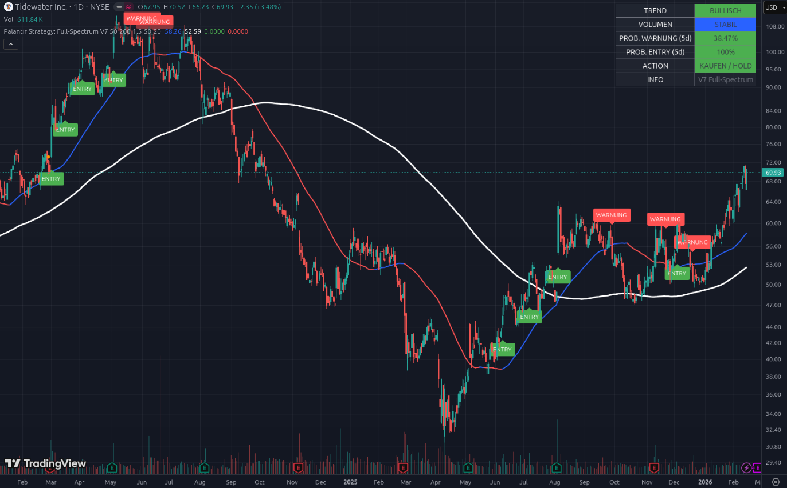

# 📘 Beispiel 9: Der „Leise Ausbruch“ – Wenn die Rakete ohne Donner startet

### Aktie im Fokus: Tidewater Inc. (TDW) | Stand: 14. Februar 2026

Tidewater ist deine „Hebel-Maschine“ im Offshore-Sektor. Der Chart von TDW ist faszinierend, weil er ein Paradoxon zeigt: Das Dashboard ist „extrem bullisch“, aber das grüne **ENTRY-Label** fehlt in der aktuellen Phase. Hier lernst du, wie du das Dashboard nutzt, um dem Markt einen Schritt voraus zu sein.

---

## 1. Das Rätsel: 100 % Wahrscheinlichkeit, aber kein Label?

Schau dir die Daten oben rechts genau an:

*   **PROB. ENTRY (5d): 100% (Grün) 🚀**
    *   Das Tool sagt dir: „Statistisch gesehen ist ein Ausbruch in den nächsten 5 Tagen absolut sicher.“ Der Kurs klebt förmlich am 50-Tage-Hoch ($70.52).
*   **Warum fehlt das grüne Label im Chart?**
    *   Die Logik des ENTRY-Labels im Script ist streng: Es braucht einen **Crossover** (Schlusskurs über dem Hoch) **UND** einen **Volumen-Schock** (mindestens 20 % über dem Durchschnitt).
    *   **Die Analyse:** Tidewater steigt aktuell stetig und kontrolliert nach oben. Es gibt (noch) keinen panischen Kaufrausch (Volumen-Peak), sondern eine **kontinuierliche Akkumulation**. Das System wartet auf den „Knall“, um das Label zu setzen – aber das Dashboard sieht die Spannung bereits jetzt.

---

## 2. Die visuelle Analyse: Die „V-Erholung“

*   **Der Absturz (Mitte des Charts):** Du siehst einen massiven Fall unter die weiße Linie (SMA 200) im Jahr 2025. Das Tool hat dich hier durch „WARNUNG“-Labels konsequent geschützt.
*   **Die Rückkehr:** Seit Ende 2025 hat TDW die weiße Linie von unten nach oben durchbrochen. Das ist ein extrem bullisches Zeichen.
*   **Der aktuelle Trend:** Die blaue Linie ist tiefblau und zeigt steil nach oben (**TREND: BULLISCH**). Die Aktie hat gerade eine „Tassen“-Formation abgeschlossen und steht nun am Rand des Ausbruchs.

---

## 3. Das Dashboard: Das Flüstern der Profis

### A. VOLUMEN: STABIL (Blau) 🔵
Obwohl die Aktie steigt, ist das Volumen nicht „rot“ (Abverkauf) und nicht „grün“ (Akkumulation durch Panik). Es ist blau. Das bedeutet: **Das Angebot an Aktien ist extrem knapp.** Niemand will verkaufen, daher reicht schon wenig Kaufinteresse aus, um den Preis nach oben zu treiben. 

### B. PROB. WARNUNG (5d): 38.47% (Grün/Niedrig)
Das Risiko eines Absturzes unter die blaue Linie ($58.26) ist gering. Die Käufer stehen bereit, jeden kleinen Rücksetzer sofort aufzufangen.

---

## 4. Konsequenzen: Wie handelst du den „leisen Ausbruch“?

Tidewater ist die Aktie, für die du **Cameco (CCJ)** opfern wolltest. Dieser Chart gibt dir die finale Bestätigung:

1.  **Nicht auf das Label warten:** Wenn das Dashboard **100 % Entry-Wahrscheinlichkeit** zeigt und die **Action auf „KAUFEN / HOLD“** steht, ist das dein Signal. Das grüne Label wird wahrscheinlich erst erscheinen, wenn die Aktie bereits bei $75 oder $80 steht und die breite Masse aufwacht.
2.  **Der strategische Einstieg:** Da TDW gerade bei **$69.93** steht und das 50-Tage-Hoch bei **$70.52** liegt, ist dies der perfekte Moment für den „Antizipations-Kauf“. Du kaufst, *bevor* der offizielle Ausbruch im Fernsehen oder auf Social Media diskutiert wird.
3.  **Die Sektor-Stärke:** Da der Energie-Sektor (Minen, Uran, Offshore) gerade die Sektor-Rotation gewinnt, hat TDW Rückenwind, den Software-Werte wie SAP gerade schmerzlich vermissen.

---

### Zusammenfassung für Einsteiger
Tidewater zeigt uns, dass man manchmal auf das „Flüstern“ des Dashboards hören muss, statt auf den „Knall“ des ENTRY-Labels zu warten. 

**Das Tool sagt dir:** „Wir stehen direkt vor der Tür. Der Druck im Kessel ist bei 100 %. Das Volumen ist stabil, es gibt keinen Verkaufsdruck. Wenn du die Explosion mitnehmen willst, ist jetzt der Moment, die Position von CCJ hierher zu rollen.“

---
*Hinweis: Ein 'leiser Ausbruch' ohne Volumen-Peak ist oft nachhaltiger als ein Hype-Ausbruch, da er zeigt, dass die Aktie aus echtem Mangel an Verkäufern steigt.*