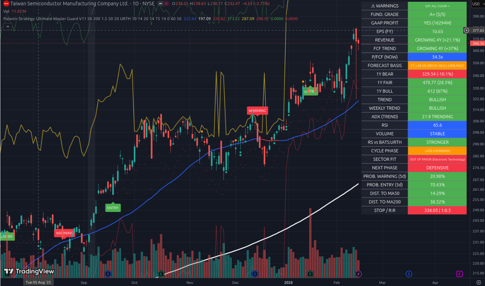
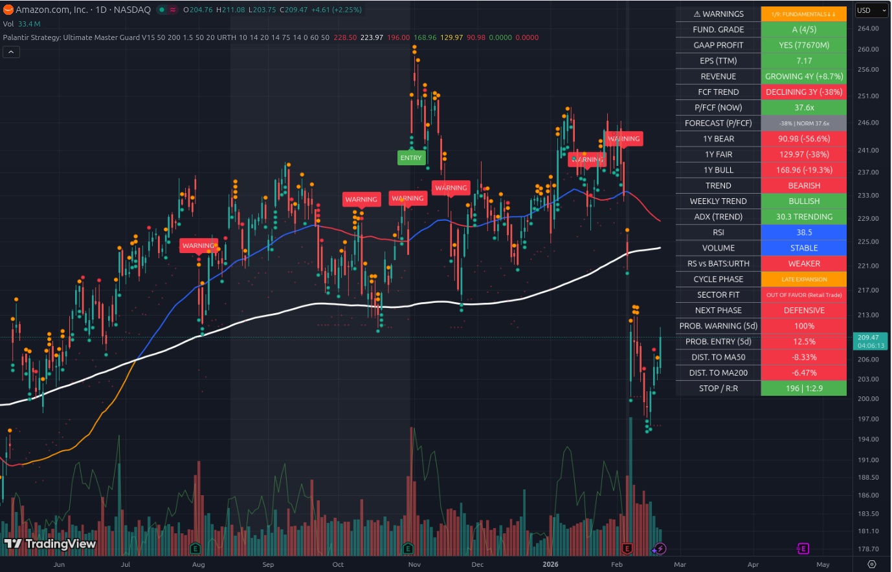
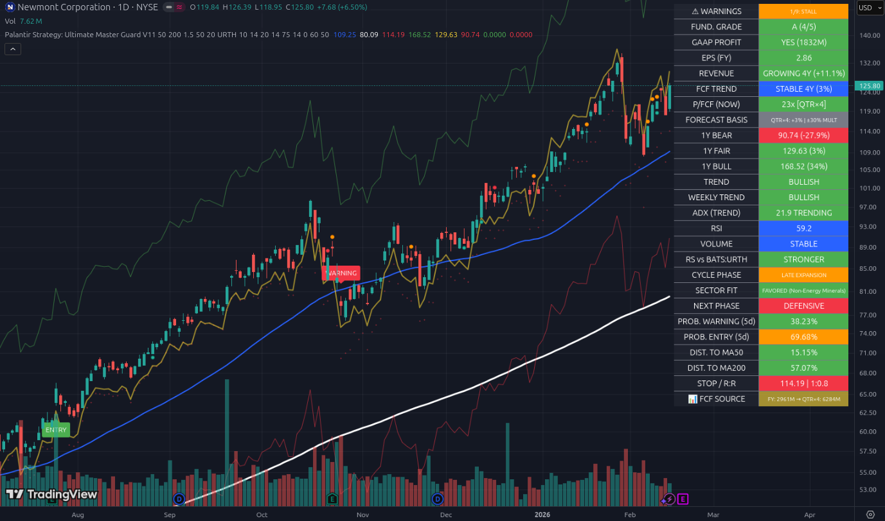
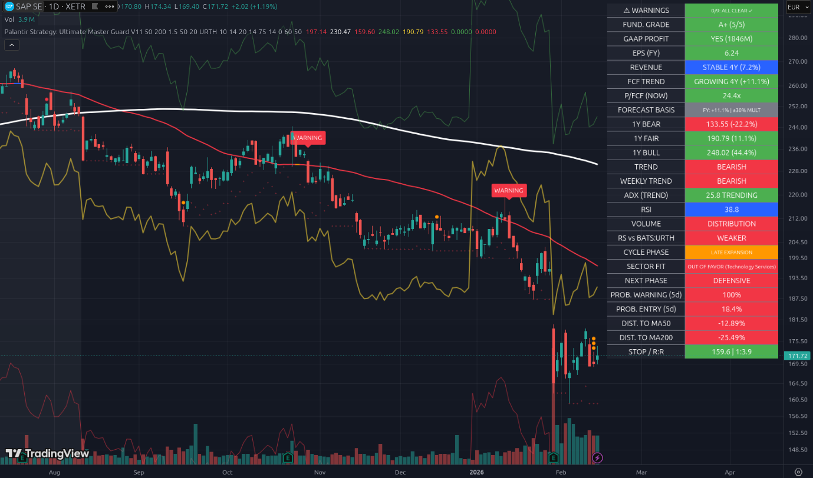
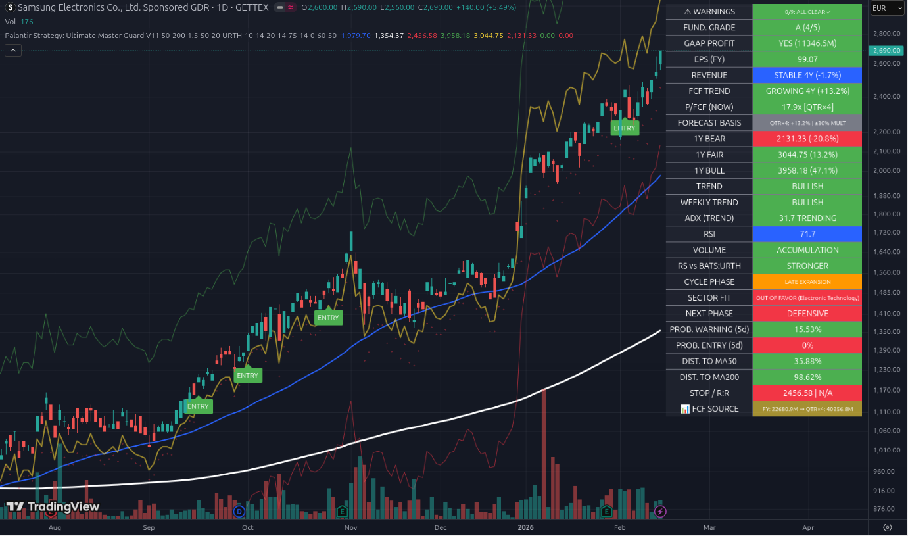
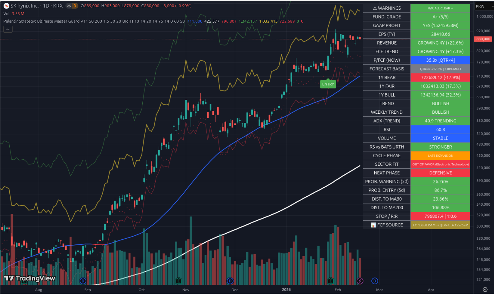
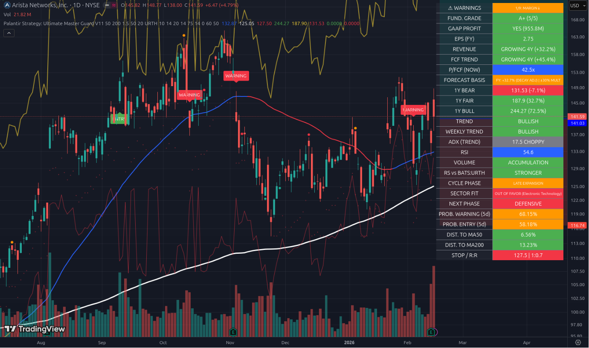
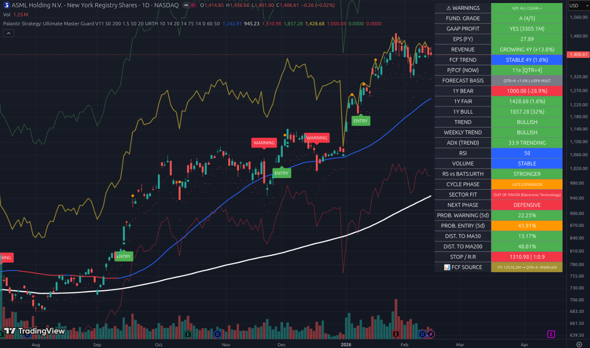
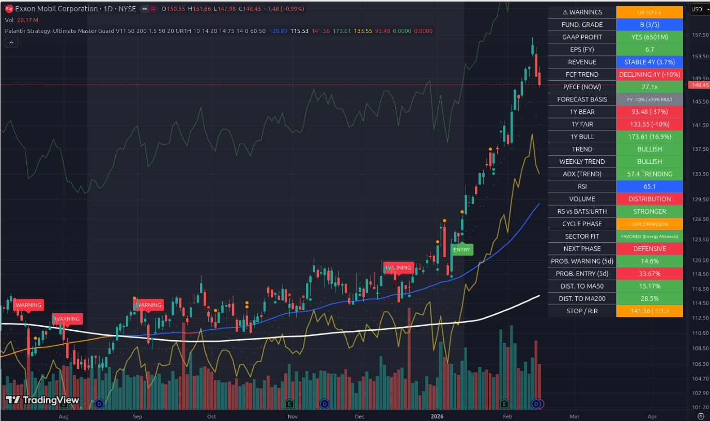

# 📘 The Ultimate Manual: Trading with Master Guard V11
### From Beginner to Pro: Mastering Fundamental & Technical Market Analysis

## 📑 Table of Contents

1.  **Introduction:** Why most traders fail (and how this tool helps)
2.  **The Two Trader Types:** Are you "Value" or "Momentum"?
3.  **Chapter 1: Reading the Dashboard** – The Health Check
4.  **Chapter 2: The V11 Special Logic** – How the Algorithm "Thinks"
5.  **Chapter 3: Technical Signals** – When do I buy?
6.  **Chapter 4: Practice Masterclass (10 Case Studies)** – The Core Learning
7.  **The Pro Checklist**
8.  **Risk Disclaimer**

---

## 1. Introduction: Solving the Problem

Most traders lose money because they only look at **one** side of the coin:
*   **Pure Technicians:** Buy stocks that are rising, but don't realize the company is on the verge of bankruptcy.
*   **Pure Fundamentalists:** Buy "cheap" stocks, but don't realize the market has a good reason to sell them (so-called "Value Traps").

The **Ultimate Master Guard V11** is a **Hybrid**. It combines institutional balance sheet data (Revenue, Cash Flow, Earnings) with price action (Trend, Volume). It tells you not just *that* the price is moving, but *if the movement is justified*.

---

## 2. The Two Trader Types: Who Are You?

Before using the tool, you must know which lens you are wearing.

### 🏛️ Type A: The Value Investor ("The Bargain Hunter")
You want to buy high-quality companies (Grade A+) when they are currently "on sale" (Crash or Correction).
*   **Your Signal:** Price is falling, but **FUND. GRADE** remains green and **WARNINGS** are 0.
*   **Your Risk:** You often catch a "falling knife".
*   **Example in this guide:** SAP.

### 🚀 Type B: The Momentum Trader ("The Surfer")
You want to buy stocks that are currently "hot" and breaking out. The valuation matters less to you, as long as the trend is strong.
*   **Your Signal:** Price breaks out (Entry), **ADX** is high, Sector is "Favored".
*   **Your Risk:** You buy too expensive and get caught in a crash.
*   **Example in this guide:** Noble Corp, SK Hynix.

---

## Chapter 1: Reading the Dashboard – The Health Check

In the top right corner of the chart, you see the dashboard. Think of it as your car's dashboard computer.

### 1. FUND. GRADE (The Report Card)
The system objectively grades every stock from **A+** to **F**.
*   **A+ / A:** The company is highly profitable, growing, and has healthy cash flow. (Buy candidates).
*   **B:** Solid, but perhaps not a growth miracle (e.g., Exxon).
*   **C / D / F:** Stay away! Something is wrong here (Losses, shrinking business).

### 2. WARNINGS (The Warning Lights)
The indicator checks for 9 "Deadly Sins" in the background.
*   **Ideal:** **0/9** ("ALL CLEAR").
*   **Acceptable:** **1/9** (If you understand the reason).
*   **Dangerous:** **>2/9**. The statistical risk is too high.
*   *Examples of warnings:*
    *   `DILUTION`: The company is printing new shares, diluting your ownership.
    *   `MARGIN↓`: The company sells more, but earns less per unit.
    *   `FCF↓↓`: Free Cash Flow is collapsing.

### 3. P/FCF (The Valuation)
Is the stock expensive or cheap? We use **Price-to-Free-Cash-Flow** because earnings can be manipulated via accounting, but cash flow cannot.
*   🟢 **Green (< 30x):** Cheap. Value Zone.
*   🔵 **Blue (30x - 60x):** Fair to Premium. Typical for strong Tech stocks.
*   🔴 **Red (> 60x):** Expensive. A lot of hope is priced in here.

---

## Chapter 2: The V11 Special Logic – How the Algorithm "Thinks"

Version 11 introduces three intelligent functions that beginners often miss, but which are crucial.

### 1. Smart FCF [QTR×4] ("The Turnaround Detector")
Sometimes a company (e.g., a gold mine) makes a sudden profit jump, but the annual report doesn't show it yet. The stock looks expensive (old data), but is actually cheap (new profit).
*   **The Function:** If the last quarter was extremely strong, V11 ignores the last year and multiplies the quarter by 4.
*   **Detection:** Look for the yellow tag **[QTR×4]** next to P/FCF.
*   **Meaning:** "Attention, the valuation is much better than it looks at first glance!"

### 2. Investment Phase ("The Amazon Exception")
Normally, sinking cash flow is a sell signal. But if a company like Amazon pours billions into new data centers, that is good for the future.
*   **The Function:** If Revenue rises (+), but Cash Flow falls (-), V11 marks this as **⚠ PHASE: INVESTING**.
*   **Meaning:** Warnings are suppressed. The system says: "Don't panic, they are just investing."

### 3. Cyclical Boom ("The Cycle Trap")
Cyclical stocks (Oil, Semiconductors) look cheapest at the peak of the boom, right before they crash.
*   **The Function:** If growth is explosive (>50%), **🔥 CYCLICAL BOOM** appears.
*   **Meaning:** The system automatically lowers the future forecast because this boom won't last forever.

---

## Chapter 3: Technical Signals – When do I buy?

### 1. Trend & ADX
*   **SMA 50 (Blue/Red):** Short-term trend. Price above = Good.
*   **SMA 200 (White):** Long-term trend. Price below = Bear Market.
*   **ADX:** Shows the *strength* of the trend (not the direction).
    *   Under 20: No trend (Choppy). Wait.
    *   Over 25: Trend established. Trade.
    *   Over 50: Overheating imminent (Parabolic).

### 2. The MA200 Distance (The Rubber Band)
This is one of the most important indicators in the script: **DIST. TO MA200**.
Imagine a rubber band. If you stretch it too far, it snaps back.
*   **> 30%:** Caution, expensive.
*   **> 50%:** "Parabolic". Extreme risk of pullback.
*   **> 100%:** Historic Bubble (Pure gambling).

### 3. R:R (Risk to Reward)
At the bottom of the dashboard, find **STOP / R:R**.
*   It calculates: How much can you win (to the last high), and how much can you lose (to the Stop Loss).
*   Is the number **Red (< 1:2)**: The trade is mathematically not worth it.
*   Is the number **Green (> 1:2)**: Good ratio.

---

## Chapter 4: Practice Masterclass (10 Case Studies)

Now we apply everything we've learned. We will go through 10 real charts. Read these analyses carefully; this is where you learn "Trader Thinking".

### Lesson 1: The Perfect "Monopolist" – TSMC
*Theme: What quality looks like.*

*   **First Look:**
    *   **Grade:** A+ (Perfect).
    *   **Warnings:** 0/9 (Clean).
    *   **Trend:** Bullish (Price above Blue and White lines).
*   **The Analysis:**
    *   The company is a monopoly. Revenue (+21%) and Cash Flow (+37%) are growing strongly.
    *   The **P/FCF of 54x** seems high (Blue), but is justified because Cash Flow is growing so fast.
    *   **Forecast:** The yellow line (Fair Value) points upwards.
*   **Conclusion:** This is a "Buy and Hold" candidate for long-term investors. No red flags.

---

### Lesson 2: Unmasking the "Investment Trap" – Amazon (AMZN)
*Theme: Why red numbers are sometimes green.*

*   **The Shock:**
    *   Look at **FCF TREND**: **DECLINING -51%** (Red). Normally, you run away here.
    *   Technically, the chart is "BEARISH" (Price falling).
*   **The V11 Insight:**
    *   The dashboard shows **⚠ PHASE: INVESTING**.
    *   The system recognized: Revenue is growing (+11%), only Cash Flow is dropping due to CapEx (AI Data Centers).
    *   Therefore: **WARNINGS 0/9**. The system correctly suppresses the FCF warning.
    *   Thanks to **[QTR×4]**, the P/FCF is corrected from ~270x to **36x**.
*   **Conclusion:** The indicator prevents you from falsely classifying Amazon as a "broken company". It is a buying opportunity on the dip.

---

### Lesson 3: The Turnaround – Newmont (NEM)
*Theme: The Power of Quarterly Annualization (QTRx4).*

*   **The Problem:**
    *   Mining stocks fluctuate wildly. Newmont had a bad prior year. With old data, the stock would look extremely expensive.
*   **The V11 Solution:**
    *   Look at the line **FCF SOURCE**. It says: "FY: 2961M -> **QTRx4: 6284M**".
    *   The script noticed: "Hey, in the last quarter they earned twice as much money as usual!"
    *   It re-evaluates the stock to **23x P/FCF** (Green/Cheap).
*   **Conclusion:** Without this tool, you might have missed the breakout (Entry Signal in August) because you thought the stock was fundamentally too expensive.

---

### Lesson 4: The Value Opportunity – SAP
*Theme: Catching the "Falling Knife" (Only for Value Investors!).*

*   **The Situation:**
    *   The price crashes (-35%). Everything is red. Technically a disaster ("BEARISH").
    *   Momentum Traders (Type B) won't touch this.
*   **The Value View (Type A):**
    *   Look at the dashboard: **Grade A+**. **Warnings 0/9**.
    *   The business (Cloud Software) is running fantastically, only the stock price is falling.
    *   **P/FCF:** At **24.4x**, SAP is rarely this cheap.
    *   **R:R (Risk/Reward):** **1:3.9** (Green). This is the best ratio of all tested stocks.
*   **Conclusion:** The script is screaming "Bargain!" here. But you need nerves of steel to buy against the trend.

---

### Lesson 5: Momentum Hype & Danger – Samsung & SK Hynix
*Theme: When is "too high" really too high?*

*   **The Scenario:**
    *   Both stocks are benefiting from the AI Memory boom in Korea.
    *   Fundamentally, both are Top (A/A+).
*   **The Warning Signal:**
    *   Look at **DIST. TO MA200** for both.
    *   Samsung: **98%**. SK Hynix: **106%**.
    *   This means: The price is **double** the long-term average. This is historically extremely rare.
*   **The Lesson:**
    *   Even if a company is fundamentally "A+" (like SK Hynix), you shouldn't buy at any price.
    *   At >100% distance to MA200, the risk of a crash (Mean Reversion) is gigantic. Do not buy new positions here.

---

### Lesson 6: The Cyclical Boom – Noble Corp (NE)
*Theme: The Trap of Cyclicals.*

*   **The Picture:**
    *   Price explodes upwards. **ADX 44** (Extremely strong trend).
    *   Fundamentally looks dreamy: FCF growing by **+60%**.
*   **The Trap:**
    *   Offshore Drilling is extremely cyclical. If oil prices fall, these profits are gone tomorrow.
    *   The script shows **🔥 CYCLICAL BOOM**.
    *   It warns you: "Don't believe these growth numbers are forever."
*   **Conclusion:** A great trade for momentum, but exit as soon as the trend breaks (MA50 crossunder). Not a stock to inherit to your grandchildren.

---

### Lesson 7: Quality with a Scratch – Arista (ANET)
*Theme: Reading the fine details.*

*   **Analysis:**
    *   Grade A+ (5/5). One of the best companies in the world.
    *   Sector "OUT OF FAVOR" (Tech is currently unloved), but the stock rises anyway (Relative Strength: STRONGER). This shows immense quality.
*   **The Detail:**
    *   Warning **MARGIN↓**.
    *   This means: Revenue is growing (+32%), but profit isn't keeping up. Arista might have to give discounts to fend off competitors.
*   **Conclusion:** Complaining on a high level, but a first warning sign to keep an eye on.

---

### Lesson 8: The ASML Data Problem – ASML
*Theme: When data lies (Lumpiness).*

*   **The Anomaly:**
    *   The script shows a **P/FCF of 11x**. For a monopoly like ASML, that would be a gift.
*   **The Reality:**
    *   ASML sells machines for €300M. If they deliver many in one quarter, cash flow explodes briefly.
    *   The script calculates this "Super-Quarter" times 4 (**[QTRx4]**). This distorts the picture slightly too positively here.
*   **Lesson:** Trust the tool, but don't turn off your brain. ASML is cheap, but probably not *that* cheap (realistically closer to 25-30x). Still: **0/9 Warnings** confirms the quality.

---

### Lesson 9: Divergence – Exxon Mobil (XOM)
*Theme: Momentum without Foundation.*

*   **The Picture:**
    *   Trend is Bullish (Green). Sector is "FAVORED" (Energy does well in late cycles).
    *   But Fundamental: Grade **B**, Warning **FCF↓↓** (Cash Flow dropping).
*   **What is happening here?**
    *   Price is rising because oil is expensive (Sector Rotation). But operationally, the company is losing cash flow power (-10%).
*   **Strategy:**
    *   This is a pure "Trade". As long as the music plays (Trend green), dance along. But as soon as the music stops, sell immediately, because the fundamentals won't support the price long-term.

---

## 7. The Pro Checklist

Print this page. Go through these points **before** you click "Buy".

### A) The Health Check (Fundamental)
1.  [ ] Is the **FUND. GRADE** at least **B**? (Better A or A+)
2.  [ ] Are **WARNINGS** less than 2?
3.  [ ] Are there deadly warnings (`DILUTION`, `DEBT`)? -> *Abort.*

### B) The Valuation Check
1.  [ ] Is **P/FCF** Green or Blue?
2.  [ ] Is there a **[QTR×4]** tag? -> *Check: Is it a real Turnaround (Newmont) or a Data Error (ASML)?*
3.  [ ] Does it say **🔥 CYCLICAL BOOM**? -> *Caution, do not buy at the high.*

### C) The Technical Check (Timing)
1.  [ ] **Trend:** Is the price above the **SMA 50** (blue line)?
2.  [ ] **Overheating:** Is the **DIST TO MA200** under 50%? (If >50%, only partial positions or wait).
3.  [ ] **Opportunity:** Is the **R:R** (Risk/Reward) green (> 1:2)?
    *   *Exception:* Momentum Traders ignore R:R on breakouts if ADX > 25.

### D) The Macro Picture
1.  [ ] Does the Sector (**SECTOR FIT**) match the current phase? ("Favored" is a tailwind).

---

## 8. Risk Disclaimer

**IMPORTANT – PLEASE READ CAREFULLY:**

Trading in financial markets (Stocks, Derivatives, Crypto, Commodities) involves **significant risks** and can lead to the **total loss** of your invested capital.

1.  **No Financial Advice:** This manual, the analyses, and the discussed "Master Guard V11" script serve exclusively for **educational and informational purposes**. It is **not** a solicitation to buy or sell securities.
2.  **Personal Responsibility:** You make all investment decisions on your own responsibility. The authors assume no liability for losses incurred through the use of this tool.
3.  **Software Limitation:** Technical indicators and fundamental data are based on the past. They do not guarantee future profits. Calculations like the [QTR×4] adjustment are mathematical models that leave room for interpretation.
4.  **Data Quality:** Data is sourced from TradingView. No guarantee is assumed for its accuracy.
5.  **Stop-Loss:** Never trade without protection (Stop-Loss).

**Good luck on your journey from Beginner to Pro Trader!**