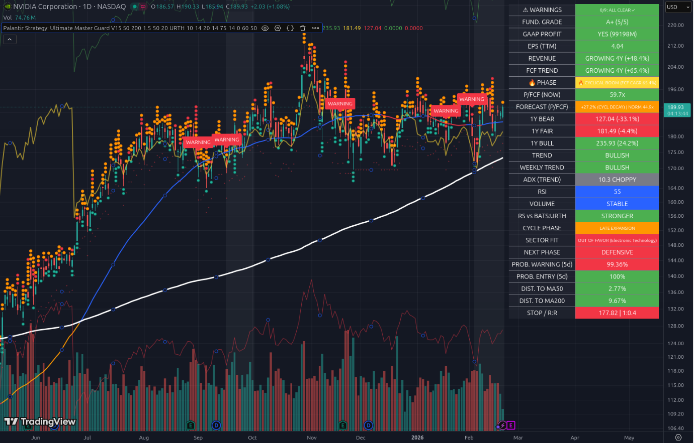
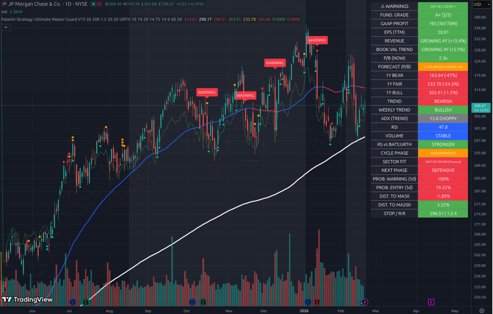
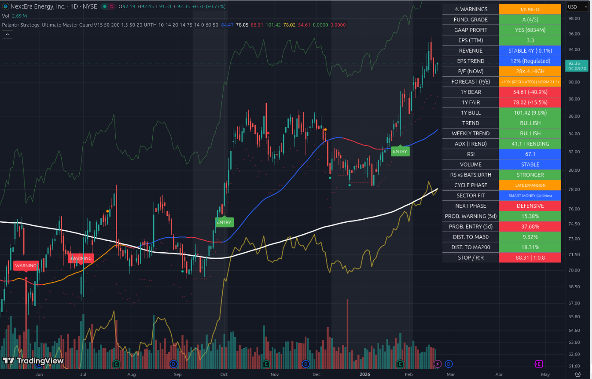
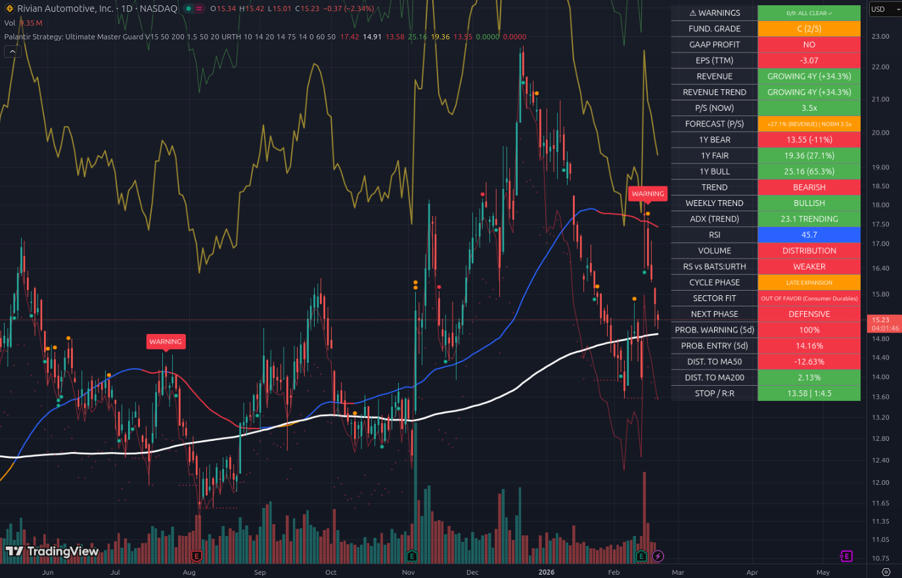
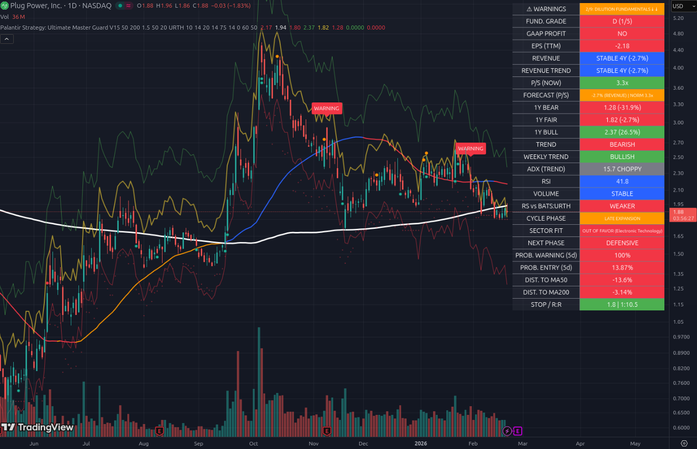
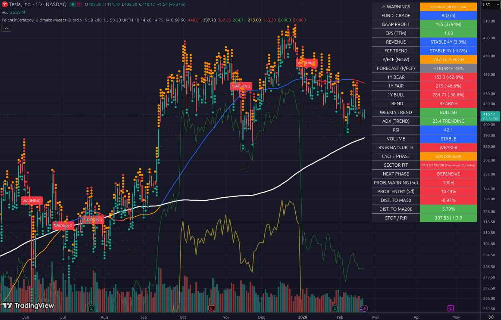
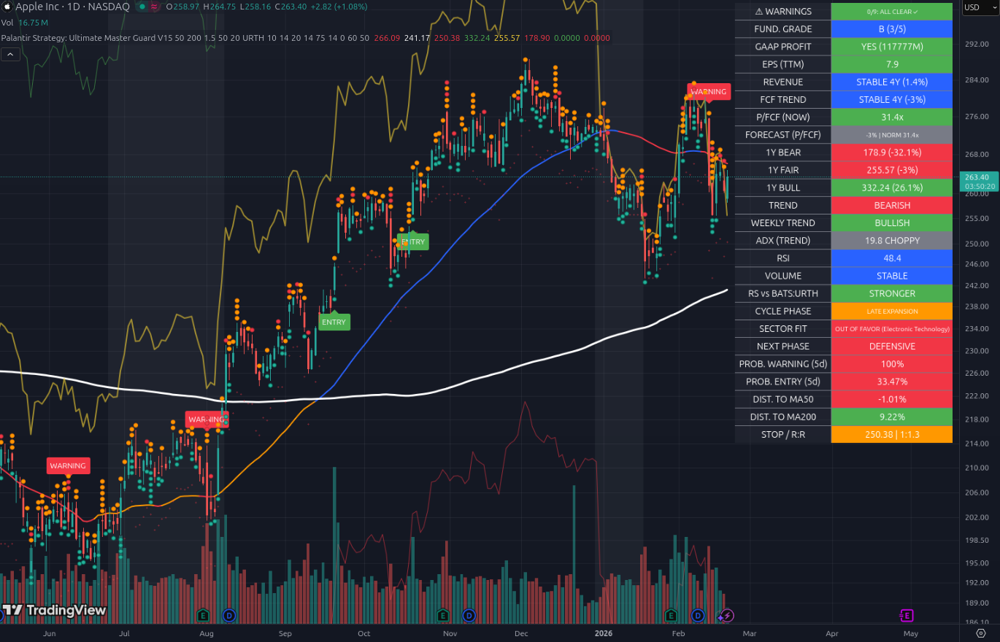

# 📖 Master Guard V15: Das Große Handbuch
## Strategische Fundamentalanalyse & Algorithmische Markttechnik
**Version:** Ultimate V15 (2025/2026 Edition)

---

## 📑 Inhaltsverzeichnis
1.  Philosophie: Alpha-Faktoren im Zusammenspiel
2.  Sektor-Rotation: Das Herzstück (Macro-Overlay)
3.  Bewertungsmodelle: Dynamisch & Multifaktoriell
4.  Fundamentale Metriken & CAGR-Logik
5.  Algorithmische Kursprognose (Smart Forecast)
6.  Technische Markttechnik & Volatilitäts-Wahrscheinlichkeit
7.  9-Punkte-Warnsystem (Risk-Guard)
8.  Dashboard: Alle Zellen im Detail
9.  Risikomanagement & Positionsgrößung
10. Praxis-Leitfaden & Psychologie

---

## 1. Philosophie: Die Symbiose aus Alpha-Faktoren
Master Guard V15 erkennt: Aktienkurse werden kurzfristig von Psychologie (Technik) beeinflusst, langfristig folgen sie den Fundamentaldaten (Cashflows).

V15 ist ein **Expertensystem** – es simuliert ein Analysten-Team:
- **Makro-Analyst:** Sektor-Rotation
- **Bilanz-Analyst:** Cashflows & Verschuldung
- **Mathematiker:** Volatilitäts-Wahrscheinlichkeiten
- **Chart-Techniker:** Trends & Einstiegspunkte

**Tipp:** Denke wie ein Profi – zuerst Risiko, dann Chance.

---

## 2. Sektor-Rotation: Das Herzstück (Macro-Overlay)
Der häufigste Fehler: Gute Aktie, falscher Sektor. V15 misst den globalen Geldfluss mit dem Rotation-Modul.

### Sektor-Punktzahl (ScorePhases)
Vergleich von sechs Sektor-ETFs (XLK, XLF, XLV, XLE, XLP, XLU) über:
1. **Langfristig (60 Tage):** Strukturelle Phase
2. **Kurzfristig (20 Tage):** Schnelle Rotationen (Smart Money)

**Phasen-Logik:**
- **Early Recovery:** Finanzen schlagen Tech – Start des Bullenmarkts
- **Mid Expansion:** Tech führt – höchste Gewinne
- **Late Expansion:** Energie & Materialien steigen – Zyklusende naht
- **Defensive:** Nur Versorger & Basiskonsum gewinnen – Markt riskant

**Sector Fit:** Das Tool erkennt den Sektor deiner Aktie (`syminfo.sector`). Warnung bei Rückenwind-Mangel.

**Tipp:** Kaufe nur Aktien mit Sektor-Rückenwind.

---

## 3. Bewertungsmodelle: Dynamisch & Multifaktoriell
Früher: Nur Free Cash Flow (FCF). Jetzt: Modellwahl nach Geschäftsmodell.

### A. Buchwert-Modell (Banken/Finanzen)
Banken: Kein klassischer FCF – daher **P/B** (Kurs-Buchwert-Verhältnis). Fokus: Eigenkapital-Wachstum (`Equity CAGR`).

### B. Earnings-Modell (Versorger)
Versorger: Häufig negative Cashflows wegen Investitionen. V15 nutzt **KGV (P/E)** auf TTM-Gewinne.

### C. Sales-Modell (Unprofitable Growth)
Junge Firmen ohne Gewinn: **KUV (P/S)**. Umsatzwachstum als Überlebensfaktor.

**Tipp:** Prüfe das Bewertungsmodell – passt es zum Geschäftsmodell?

---

## 4. Fundamentale Metriken & CAGR-Logik
V15 nutzt eine 5-Jahres-Regression (Y0 bis Y4).

### CAGR (Compound Annual Growth Rate)
Intelligente Fallback-Logik:
- 4 Jahre Daten → 4Y CAGR
- 1 Jahr → YOY-Vergleich
- **Turnaround:** Von Verlust zu Gewinn → als "TURNAROUND" markiert (100% Wachstum)

### FCF Run-Rate (Cyclical-Boost)
Massiver Aufschwung erkannt, wenn Quartals-Cashflow (`FQ * 4`) > 75% über Vorjahr. V15 nutzt dann die Run-Rate – ideal für zyklische Aktien.

**Tipp:** Zyklische Booms früh erkennen – Run-Rate nutzen!

---

## 5. Algorithmische Kursprognose (Smart Forecast)
V15 berechnet einen **Fair Value** für die nächsten 12 Monate – keine statischen Linien.

### Wachstums-Dämpfung (Decay Growth)
Mathematische Dämpfung:
- Wachstum > 50% → auf 35% + Rest gedämpft
- Wachstum > 20% → halbiert
So entstehen realistische Kursziele.

### Multiple-Normalisierung
Extrem hohe Multiples (z.B. P/FCF 200x) werden zum Mittelwert zurückgeführt. Prognose basiert auf normalisiertem Multiple.

**Tipp:** Kursziele immer mit Wachstums-Dämpfung und Multiple-Normalisierung prüfen.

---

## 6. Technische Markttechnik & Wahrscheinlichkeit
Kombination aus klassischen Indikatoren und moderner Statistik.

### Wahrscheinlichkeitsrechnung (Prob. Entry/Warning)
V15 nutzt Log-Returns & Standardabweichungen:
1. Log-Return: Tägliche prozentuale Veränderung
2. Expected Move: Statistisch wahrscheinliche Bewegung (5 Tage)
3. Prob. Entry: Wahrscheinlichkeit, das 50-Tage-Hoch zu brechen
4. Prob. Warning: Wahrscheinlichkeit, unter SMA 50 zu fallen

### Weekly-Filter (Trend-Schutz)
Einstiegssignal nur gültig, wenn 10-Wochen-Schnitt > 40-Wochen-Schnitt (SMA 50/200 auf Wochenbasis).

**Tipp:** Immer den Wochenchart prüfen – Tageschart allein reicht nicht!

---

## 7. 9-Punkte-Warnsystem (Risk-Guard)
Das System scannt 9 spezifische Risiken:

1. **DILUTION:** Aktienzahl steigt >5% → Verwässerung
2. **NEGATIVE METRIC:** Cashflow/Buchwert negativ → Insolvenzrisiko
3. **OVERVALUED:** Multiple über historischem Limit (z.B. >60)
4. **FUNDAMENTALS↓↓:** Wachstumsraten sinken
5. **MARGIN SQUEEZE:** Umsatz steigt, Gewinn sinkt
6. **REV DECLINE:** Kerngeschäft schrumpft
7. **DEBT HEAVY:** Schulden > 10x FCF
8. **DETERIORATION:** Eigenkapital verschlechtert sich
9. **VALUATION SHOCK:** Preis massiv über Bull-Target

**Tipp:** Mehr als 3 Warnungen = Alarm!

---

## 8. Dashboard: Alle Zellen im Detail
Das Dashboard oben rechts ist deine Kommandozentrale.

- **⚠ WARNINGS:** Anzahl der Flaggen – 0 = Perfekt, >3 = Alarm
- **FUND. GRADE:** A+ (Elite) bis F (Schrott) – basiert auf Profitabilität & CAGR
- **GAAP PROFIT:** Nettoeinkommen nach Bilanzregeln
- **FCF/BOOK TREND:** Wachstum der Kernmetrik
- **FORECAST BASIS:** Genutzte Wachstumsrate für Prognoselinien
- **RS vs. BENCHMARK:** Vergleich mit Weltmarkt (URTH) – nur "STRONGER" kaufen!
- **STOP / R:R:** ATR-basierter Stop-Loss & Chance-Risiko-Verhältnis (>2.0)

**Tipp:** Dashboard immer vor Kaufentscheidung prüfen.

---

## 9. Risikomanagement & Positionsgrößung
V15 schützt vor übermäßigem Risiko.

### Dynamischer Stop-Loss
Zwei Faktoren:
1. **ATR (Average True Range):** Stop 2 ATR unter Kurs
2. **Base Low:** Tief der letzten 50 Tage
Automatische Wahl des sichereren Werts.

### R:R Ratio (Risk-to-Reward)
Signal nur grün, wenn Potenzial mindestens doppelt so groß wie Risiko zum Stop-Loss.

**Tipp:** R:R Ratio > 2 – sonst kein Einstieg!

---
## 10. Praxisbeispie

Das ist ein hervorragendes Beispiel-Chart! NVIDIA (NVDA) zeigt hier perfekt, wie die **V15-Logik** mit extremen Wachstumszahlen und Marktentwicklungen umgeht.

Hier ist die detaillierte Analyse für dein Handbuch, basierend auf deinem Screenshot:

---

# 📈 Unterkapitel 10.1: NVIDIA – Der Gigant am Gipfel
### (Fallstudie: Wachstumsdämpfung & Zyklische Überhitzung)

NVIDIA ist das Paradebeispiel für ein Unternehmen, das fundamental "perfekt" aussieht, bei dem das System aber zur Vorsicht mahnt, weil die Bäume nicht in den Himmel wachsen.

#### 1. Die fundamentale Exzellenz (**FUND. GRADE: A+**)
Das Dashboard zeigt eine glatte **Note A+ (5/5)**. 
*   **Warum?** Ein Umsatzwachstum von **+48,4 %** und ein FCF-Trend (Free Cash Flow) von **+65,4 %** über 4 Jahre sind absolute Elite-Werte. 
*   **GAAP PROFIT:** Mit fast **100 Milliarden Dollar** Gewinn (99.198M) ist das Unternehmen eine hochprofitable Cash-Maschine.

#### 2. Die Warnung vor dem "Zyklischen Boom" (**🔥 PHASE**)
Trotz der Bestnote leuchtet das Feld **PHASE** orange: **"🔥 CYCLICAL BOOM (FCF CAGR 65,4%)"**.
*   **Die V15-Logik:** Das System erkennt, dass ein FCF-Wachstum von 65 % langfristig mathematisch kaum zu halten ist. Es markiert dies als "zyklischen Boom". 
*   **Bedeutung für dich:** Das Risiko für eine Enttäuschung ist hoch, da die Erwartungen des Marktes gigantisch sind.

#### 3. Die Kursprognose & Wachstumsdämpfung (**FORECAST**)
Schau dir die Zeile **FORECAST (P/FCF)** genau an. Hier steht: **"+27,2% (CYCL DECAY) | NORM 44,9x"**.
*   **CYCL DECAY (Wachstumsdämpfung):** Obwohl die Firma mit 65 % gewachsen ist, nutzt V15 für die Zukunft nur noch ein gedämpftes Wachstum von +27,2 %. Warum? Um dich vor absurden Kurszielen zu schützen.
*   **NORM 44,9x:** Das aktuelle P/FCF liegt bei **59,7x**. V15 normalisiert dieses Multiple auf 44,9x für die Fair-Value-Berechnung.
*   **Die Folge:** Die gelbe Linie (**1Y FAIR**) liegt bei **181,49 USD**. Da der aktuelle Kurs bei ca. **189,93 USD** steht, signalisiert das Tool: **Die Aktie ist aktuell leicht überbewertet (-4,4 % zum Fair Value).**

#### 4. Die technische Zwickmühle (**PROB. WARNING vs. ENTRY**)
Dies ist der spannendste Teil deines Screenshots:
*   **PROB. ENTRY (5d): 100 %** -> Statistisch ist ein Ausbruch nach oben fast sicher.
*   **PROB. WARNING (5d): 99,36 %** -> Gleichzeitig ist ein Rücksetzer zum MA50 fast ebenso sicher.
*   **ADX (TREND): 10,3 CHOPPY** -> Der ADX ist extrem niedrig. Das bedeutet: Es gibt gerade keinen klaren Trend, die Aktie "zappelt" seitwärts.
*   **Interpretation:** Wir befinden uns in einer extremen Spannungszone. Ein gewaltiger Ausbruch in *irgendeine* Richtung steht bevor.

#### 5. Sektor-Rotation & Makro-Umfeld
*   **CYCLE PHASE: LATE EXPANSION** -> Wir sind im Spätzyklus.
*   **SECTOR FIT: OUT OF FAVOR** -> Obwohl NVIDIA "Stronger" als der Markt ist, ist der Sektor (Electronic Technology) laut Rotations-Modell gerade nicht der Favorit des "Smart Money". Die Anleger rotieren bereits in defensive Sektoren (**NEXT PHASE: DEFENSIVE**).

#### 6. Das Urteil: R:R (Chance-Risiko-Verhältnis)
Die unterste Zeile ist **Tiefrot**: **STOP / R:R | 1:0,4**.
*   **Das bedeutet:** Für jeden Dollar, den du gewinnen kannst (zum Bull-Target), riskierst du 2,50 Dollar Verlust (zum Stop-Loss).
*   **Fazit des Master Guards:** Fundamental eine 1+, aber technisch und preislich aktuell **kein guter Einstieg**. Das Chance-Risiko-Verhältnis ist zu schlecht. **Warten auf einen Rücksetzer zur gelben Fair-Value-Linie (181,49) oder zum SMA 50.**

---
*Dieses Beispiel zeigt perfekt, dass eine "A+" Aktie nicht automatisch ein "Kauf" ist, wenn der Preis bereits über dem fairen Wert liegt.*

# 📈 Unterkapitel 10.2: JPMorgan – Das Banken-Modell (P/B)
### (Fallstudie: Buchwert-Bewertung & Bewertungs-Schwerkraft)

JPMorgan zeigt uns, wie der Master Guard V15 bei Finanzinstituten automatisch die Strategie ändert. Da Banken kein klassisches "Produktionsgeschäft" haben, ist der Cashflow weniger aussagekräftig als der **Buchwert**.

#### 1. Automatischer Modell-Wechsel (**Model: BOOK**)
Schau in die Zeile **P/B (NOW)** und **BOOK VAL TREND**. 
*   **Die V15-Logik:** Das System erkennt den Sektor "Finance" und schaltet sofort vom FCF-Modell auf das **Kurs-Buchwert-Verhältnis (P/B)** um.
*   **Fundamentale Stärke:** Mit einem Buchwert-Wachstum von **+5,5 %** (Growing 4Y) und einer glatten **Note A+** bleibt JPMorgan die unangefochtene Qualitätsbank.

#### 2. Das Warnsignal: Massive Überbewertung (**1Y FAIR**)
Dies ist das wichtigste Detail in diesem Chart. Schau dir die Preisprognosen an:
*   **P/B (NOW): 2,3x** -> Die Aktie wird aktuell mit dem 2,3-fachen ihres Buchwerts gehandelt.
*   **NORM 1,6x:** Die V15-Logik sagt: "Normalerweise ist JPMorgan 1,6x wert."
*   **Die Folge:** Der **1Y FAIR (Fair Value)** liegt bei **233,78 USD**. Der aktuelle Kurs steht aber bei **308,67 USD**.
*   **Das Urteil:** Selbst das optimistische **1Y BULL Target (303,91 USD)** liegt *unter* dem aktuellen Preis! Das Tool sagt dir unmissverständlich: **Du kaufst hier am absoluten historischen Limit.**

#### 3. Technischer Zerfall (**TREND: BEARISH**)
Während NVIDIA (im vorherigen Kapitel) noch im Aufwärtstrend zappelte, ist JPMorgan bereits einen Schritt weiter:
*   **TREND: BEARISH** -> Die kurzfristige Momentum-Linie (SMA 50) wurde nach unten durchbrochen.
*   **PROB. WARNING (5d): 100 %** -> Das System ist sich statistisch sicher, dass der Abwärtstrend anhält.
*   **PROB. ENTRY (5d): 19,32 %** -> Die Chance auf ein neues Hoch in den nächsten 5 Tagen ist extrem gering.

#### 4. Sektor-Rotation & Makro-Gegenwind
*   **CYCLE PHASE: LATE EXPANSION** -> Wir sind spät im Zyklus.
*   **SECTOR FIT: OUT OF FAVOR (Finance)** -> Das "Smart Money" zieht bereits Geld aus dem Finanzsektor ab und schichtet in defensive Werte um (**NEXT PHASE: DEFENSIVE**). 
*   **Bedeutung:** JPMorgan hat keinen Rückenwind mehr vom Gesamtmarkt.

#### 5. Das Paradoxon: R:R ist "Grün" (**STOP / R:R**)
Warum leuchtet die unterste Zeile **STOP / R:R | 1:2,4** grün?
*   **Die Erklärung:** Das Tool berechnet das R:R immer zum nächsten signifikanten Hoch/Ziel. Da der Kurs bereits stark gefallen ist, liegt der Stop-Loss (296,51) sehr nah. Rein technisch gesehen wäre das Risiko bei einem Einstieg klein, **ABER**:
*   **Die Master-Guard-Regel:** Ein grünes R:R allein reicht nicht! Wenn der **TREND auf BEARISH** steht und der Preis massiv über dem **1Y FAIR** liegt, ist ein Einstieg verboten. Das grüne Feld zeigt hier lediglich, dass der Preis ein technisches Unterstützungsniveau erreicht hat.

#### 6. Fazit des Master Guards für JPM
JPMorgan ist eine großartige Bank (Grade A+), aber eine **furchtbare Investition zum aktuellen Preis**. 
*   Die Aktie muss laut V15-Modell um mindestens **-24 % fallen**, um wieder ihren "Fairen Wert" zu erreichen. 
*   **Handlungsempfehlung:** Füße stillhalten. Erst wenn der Preis sich der gelben Fair-Value-Linie (233,78) annähert und der Trend wieder auf "Bullish" dreht, wird JPMorgan wieder zum Kaufkandidaten.

---
*Lerneffekt: Die V15 schützt dich davor, "Qualität zu jedem Preis" zu kaufen. Selbst die beste Bank der Welt ist kein Kauf, wenn sie 40 % über ihrem fairen Buchwert-Multiple gehandelt wird.*

# 📈 Unterkapitel 10.3: NextEra Energy – Das Versorger-Modell (P/E)
### (Fallstudie: Reguliertes Wachstum & "Smart Money" Rotation)

NextEra Energy zeigt uns, wie der Master Guard V15 mit Unternehmen umgeht, die massive Sachinvestitionen (Windparks, Solaranlagen) tätigen. Bei solchen Firmen ist der Cashflow oft durch hohe Ausgaben verzerrt, weshalb das System hier auf das **Gewinn-Modell (P/E)** wechselt.

#### 1. Spezialisiertes Ertragsmodell (**Model: EARNINGS**)
*   **Die V15-Logik:** Das System erkennt den Sektor "Utilities" (Versorger). Anstatt den oft negativen oder schwankenden Free Cash Flow zu nutzen, schaltet das Dashboard auf **P/E (KGV)** um.
*   **EPS TREND: 12% (Regulated):** Da Versorger in einem regulierten Umfeld agieren, kappt V15 das erwartete Wachstum konservativ bei 10-12 %. Das Tool "weiß", dass ein Stromversorger kein Tech-Wachstum von 50 % erreichen kann.
*   **FUND. GRADE: A (4/5):** Ein sehr solides Rating für einen defensiven Wert.

#### 2. Das Makro-Highlight: "Smart Money" Rotation
Dies ist einer der wichtigsten Indikatoren in der aktuellen Marktphase:
*   **CYCLE PHASE: LATE EXPANSION:** Wir sind spät im Wirtschaftszyklus.
*   **SECTOR FIT: SMART MONEY (Utilities):** Das ist ein massives Kaufsignal der V15-Logik. Im Spätzyklus flieht das große Geld ("Smart Money") aus riskanten Tech-Werten in sichere Häfen wie Versorger. 
*   **Bedeutung:** NEE hat aktuell starken institutionellen Rückenwind, was den steilen Kursanstieg erklärt.

#### 3. Warnung vor Überhitzung (**P/E > 25**)
Oben im Dashboard siehst du eine orangefarbene Warnung: **"1/9: P/E>25"**.
*   **P/E (NOW): 28x:** Für einen Versorger ist ein KGV von 28 historisch sehr hoch (**⚠ HIGH**). Normalerweise werden diese Firmen bei einem KGV von ca. 21 gehandelt (**NORM 21.5x**).
*   **Bewertungs-Loch:** Deshalb liegt der **1Y FAIR (Fair Value)** bei **78,02 USD**, während der Kurs bereits bei **92,35 USD** steht. Das System sagt: "Die Aktie steigt wegen der Sektor-Rotation, ist aber fundamental eigentlich zu teuer."

#### 4. Starke technische Dynamik (**ADX & TREND**)
*   **TREND & WEEKLY TREND: BULLISH:** Beide Zeitebenen zeigen nach oben.
*   **ADX (TREND): 41.1 TRENDING:** Ein ADX über 25 bedeutet einen starken Trend. Über 40 ist der Trend extrem kraftvoll. NEE befindet sich in einem "Runaway Train"-Szenario.
*   **RS vs. BATS:URTH: STRONGER:** NEE schlägt den Weltmarkt aktuell deutlich.

#### 5. Das Risiko: R:R und RSI
*   **RSI: 67.1:** Die Aktie nähert sich der überkauften Zone (70+).
*   **STOP / R:R | 1:0.8:** Das Chance-Risiko-Verhältnis ist **Rot**.
*   **Das Urteil:** Um das nächste Kursziel (**1Y BULL: 101.42**) zu erreichen, müsstest du ein zu großes Risiko eingehen, da der Stop-Loss (88.31) bereits weit entfernt ist.

#### 6. Fazit des Master Guards für NEE
NextEra Energy ist das perfekte "Smart Money"-Investment für den Spätzyklus, aber der Einstieg ist **jetzt** riskant.
*   **Die Strategie:** Die Aktie ist ein technischer Outperformer, aber fundamental überhitzt.
*   **Handlungsempfehlung:** Wer die Aktie hat, hält sie mit einem Trailing-Stop bei **88.31**. Für einen Neueinstieg ist die Aktie zu weit von der gelben Fair-Value-Linie (78.02) entfernt. **Warten auf einen Rücksetzer zum SMA 50.**

---
*Lerneffekt: V15 zeigt dir hier, wie Sektor-Rotation fundamentale Überbewertungen kurzfristig ignorieren kann. Aber das System warnt dich durch das schlechte R:R davor, dem Trend zu spät hinterherzulaufen.*

Dieses Chart von Amazon (AMZN) ist ein faszinierendes Beispiel für das **Investment-Dilemma** und zeigt uns die gnadenlose Ehrlichkeit des Master Guards V15, wenn es um Cashflow-Einbrüche geht.

Hier ist die detaillierte Analyse für dein Unterkapitel:

---

# 📈 Unterkapitel 10.4: Amazon – Das Investment-Dilemma
### (Fallstudie: FCF-Erosion durch CapEx & das Bewertungs-Vakuum)

Amazon ist der "Endgegner" für fundamentale Analysten, da das Unternehmen oft absichtlich seinen Cashflow (FCF) zerstört, um Milliarden in Infrastruktur (KI-Chips, Logistikzentren) zu investieren. V15 zeigt uns hier, wie es auf diese Phase reagiert.

#### 1. Die fundamentale Warnung (**1/9: FUNDAMENTALS ↓↓**)
Im Dashboard leuchtet eine orangefarbene Warnung.
*   **FCF TREND: DECLINING 3Y (-38 %):** Das ist der Schockwert. Während der Umsatz solide wächst (**+8,7 %**), bricht der Free Cash Flow massiv ein.
*   **Die V15-Logik:** Das System ist ein "Guard" (Wächter). Es sieht, dass weniger echtes Bargeld in der Kasse bleibt, und stuft die Aktie trotz **77 Milliarden Dollar GAAP-Gewinn** auf eine **Note A (4/5)** herab (anstatt A+).

#### 2. Der "Smart Forecast" Schock (**1Y FAIR: -38 %**)
Das ist ein kritischer Punkt für das Verständnis von V15. Da der FCF-Trend negativ ist (-38 %), projiziert die mathematische Formel dieses Schrumpfen in die Zukunft:
*   **1Y FAIR: 129,97 USD:** Der mathematisch faire Wert liegt laut aktuellem FCF-Trend weit unter dem aktuellen Kurs von ca. **209 USD**.
*   **Bedeutung:** V15 warnt dich: "Wenn Amazon nicht bald aufhört, so viel Geld auszugeben, ist die aktuelle Bewertung fundamental nicht haltbar." Das Tool ist hier extrem konservativ und schützt dich vor Überbewertungen.

#### 3. Sektor-Rotation & Makro-Gefahr
*   **CYCLE PHASE: LATE EXPANSION:** Wir sind spät im Zyklus.
*   **SECTOR FIT: OUT OF FAVOR (Retail Trade):** Das ist ein Warnsignal. Im Spätzyklus leiden Konsumwerte oft, da die Kaufkraft der Kunden sinkt. 
*   **RS vs. BATS:URTH: WEAKER:** Amazon verliert aktuell an relativer Stärke gegenüber dem Weltmarkt. Das "Smart Money" zieht Geld ab.

#### 4. Technischer "Crash" & Hoffnungsschimmer
*   **TREND: BEARISH:** Der Kurs ist unter den SMA 50 und SMA 200 (weiß) gefallen. Ein schweres technisches Signal.
*   **ADX (TREND): 30.3 TRENDING:** Die Abwärtsbewegung ist kein Zufall, sondern ein starker Trend.
*   **RSI: 38.5:** Die Aktie ist fast "überverkauft". 
*   **STOP / R:R | 1:2.9 (Grün):** Hier wird es interessant! Trotz der schlechten Fundamentaldaten leuchtet das R:R grün. Warum? Weil der Kurs so tief gefallen ist, dass der statistische Stop-Loss (196 USD) sehr nah ist. Das Potenzial für eine technische Erholung ist fast dreimal so groß wie das Risiko eines weiteren Falls.

#### 5. Das Urteil: "Buy the Blood" oder "Value Trap"?
Das Chart zeigt ein kleines grünes **ENTRY** Signal am Boden der aktuellen Kerze.
*   **Interpretation:** Dies ist ein **technischer Rebound-Trade**, kein langfristiges Investment-Signal. Das System erkennt, dass Amazon kurzfristig zu stark abgestraft wurde ("Mean Reversion").

#### 6. Fazit des Master Guards für AMZN
Amazon befindet sich in einer gefährlichen Übergangsphase.
*   **Die Strategie:** Wer Amazon langfristig hält, muss die FCF-Erosion als "Investment für die Zukunft" akzeptieren. Mathematisch ist die Aktie jedoch gerade in einem **Bewertungs-Vakuum**.
*   **Handlungsempfehlung:** Nur für mutige Trader. Einstieg mit engem Stop bei **196 USD**. Ziel ist ein Rücklauf zum SMA 200. Wer Sicherheit will, wartet, bis der **FCF TREND** im Dashboard wieder grün wird.

---
*Lerneffekt: V15 ist ein emotionsloser Rechner. Wenn der Cashflow sinkt, senkt das Tool die Kursziele drastisch – auch bei Weltmarken wie Amazon. Es zwingt dich zu fragen: Ist der Cashflow-Rückgang nur vorübergehend oder ein echtes Problem?*

Das ist ein hervorragender Tausch! **Noble Corporation (NE)** ist ein Offshore-Bohrunternehmen und damit das absolut perfekte Beispiel für eine hochzyklische Aktie. Während Exxon (XOM) oft stabiler ist, zeigt NE uns im Dashboard die volle Wucht der V15-Logik bei einem "Explosions-Szenario".

Hier ist die Analyse für dein Unterkapitel:

---

# 📈 Unterkapitel 10.5: Noble Corp – Die Zyklus-Falle
### (Fallstudie: 🔥 CYCLICAL BOOM & der Gummiband-Effekt)

Noble Corp zeigt uns, wie der Master Guard V15 reagiert, wenn eine Aktie durch einen Rohstoff-Boom (Öl/Gas) fundamental "zu gut" aussieht und technisch heißläuft.

#### 1. Das Phänomen: 🔥 CYCLICAL BOOM
Schau dir die orangefarbene Zeile **PHASE** an.
*   **FCF TREND: GROWING 3Y (+59,4 %):** Noble verdient aktuell unfassbar viel Bargeld. 
*   **Die V15-Logik:** Das System erkennt, dass ein Wachstum von fast 60 % in der Industrie (Industrial Services) eine Anomalie ist. Es markiert die Aktie als **"🔥 CYCLICAL BOOM"**.
*   **Die Warnung:** Das Tool sagt dir damit: "Glaube nicht, dass das ewig so weitergeht. Das ist ein zyklisches Hoch, kein dauerhafter Zustand."

#### 2. Intelligente Wachstumsdämpfung (**FORECAST**)
Trotz des aktuellen Wachstums von 59,4 % rechnet V15 im Forecast ganz anders:
*   **FORECAST (P/FCF): +26,1% (CYCL DECAY):** Das System "kappt" das Wachstum mathematisch auf 26 %, um dich vor unrealistischen Kurszielen zu schützen.
*   **Die Überraschung:** Da Noble fundamental extrem günstig bewertet ist (**P/FCF 16.4x**), liegt der **1Y FAIR** mit **56,31 USD** immer noch **+26,1 %** über dem aktuellen Kurs. Die Aktie ist also trotz des Anstiegs fundamental noch "billig".

#### 3. Der Sektor-Rückenwind (**FAVORED**)
*   **CYCLE PHASE: LATE EXPANSION:** Wir sind spät im Wirtschaftszyklus.
*   **SECTOR FIT: FAVORED (Industrial Services):** Das ist der Turbo für Noble. Im Spätzyklus steigen Rohstoffpreise und Dienstleistungen für die Energiebranche oft am stärksten. Noble hat hier massiven Rückenwind durch das "Smart Money".

#### 4. Die technische Gefahr: Das überspannte Gummiband
Jetzt kommen die Warnsignale, die dich vor einem Einstieg bewahren:
*   **DIST. TO MA200: 50,77 %:** Das ist ein extrem hoher Wert! Die Aktie ist über 50 % von ihrem langfristigen Durchschnitt (weiße Linie) entfernt. Historisch gesehen schnappt dieses "Gummiband" fast immer zurück.
*   **VOLUME: DISTRIBUTION (Rot):** Das ist ein kritisches Warnsignal. Trotz steigender Kurse zeigt das Volumen an, dass die "großen Fische" (Institutionelle) bereits beginnen, ihre Gewinne an gierige Privatanleger zu verkaufen.
*   **ADX (TREND): 49.4 TRENDING:** Der Trend ist zwar extrem stark, nähert sich aber der "Erschöpfungs-Zone" (über 50).

#### 5. Das Urteil: R:R (Chance-Risiko-Verhältnis)
*   **STOP / R:R | 1:0.5 (Tiefrot):** Obwohl die Aktie fundamental noch Potenzial zum Fair Value hat, ist das Timing für einen Kauf aktuell **katastrophal**.
*   **Mathematik:** Du müsstest einen Stop-Loss bei **40,96 USD** setzen. Das Risiko, in eine Korrektur zum SMA 50 zu laufen, ist viel größer als die Chance auf weitere schnelle Gewinne.

#### 6. Fazit des Master Guards für NE
Noble Corp ist eine fundamentale Perle (**Grade A+**) in einem begünstigten Sektor, aber sie ist technisch **massiv überhitzt**.
*   **Die Strategie:** Wer die Aktie hat, zieht den Stop-Loss eng nach (Trailing Stop). 
*   **Handlungsempfehlung:** **KEIN KAUF** auf diesem Niveau. Warte, bis der **DIST. TO MA200** wieder unter 20-25 % fällt und das Volumen von "Distribution" auf "Accumulation" umschaltet.

---
*Lerneffekt: V15 unterscheidet zwischen fundamentalem Wert und technischem Timing. Noble ist "wertvoll", aber "zu teuer eingekauft" (technisch), weil der Preis zu weit von der weißen MA200-Linie weggelaufen ist.*

# 📈 Unterkapitel 10.6: Rivian – Das Wachstums-Modell (P/S)
### (Fallstudie: Unprofitable Firmen & Bewertung über den Umsatz)

Rivian zeigt uns, wie der Master Guard V15 reagiert, wenn die klassischen Metriken (Gewinn und Cashflow) versagen, weil sie schlichtweg (noch) nicht vorhanden sind.

#### 1. Automatischer Wechsel zum Sales-Modell (**Model: SALES**)
Schau in die Zeilen **GAAP PROFIT** und **P/S (NOW)**.
*   **Die V15-Logik:** Da Rivian keinen Gewinn (**NO**) und keinen positiven Cashflow macht, erkennt das System, dass ein KGV oder P/FCF-Modell unbrauchbar wäre. Es schaltet automatisch auf das **P/S-Modell (Kurs-Umsatz-Verhältnis)** um.
*   **REVENUE TREND: GROWING 4Y (+34,3 %):** Das ist der einzige fundamentale Anker. Rivian wächst beim Umsatz massiv. Das System nutzt dieses Wachstum, um einen fairen Wert zu berechnen.

#### 2. Die fundamentale Note: Warum nur ein "C"? (**FUND. GRADE: C**)
Obwohl Rivian mit 34 % wächst, erhält es nur die **Note C (2/5)**.
*   **Die Erklärung:** V15 ist ein "Guard" (Wächter). Ein Unternehmen ohne Gewinne ist statistisch gesehen ein hohes Risiko. Nur wer profitabel ist, bekommt ein "A". Das "C" ist eine Warnung: "Hier wird spekuliert, nicht investiert."

#### 3. Der "Smart Forecast" Hoffnungsschimmer
Trotz der Verluste sieht die mathematische Prognose ein Potenzial:
*   **P/S (NOW): 3,5x** -> Das aktuelle Kurs-Umsatz-Verhältnis.
*   **1Y FAIR: 19,36 USD:** Da der aktuelle Kurs bei **15,23 USD** steht, liegt Rivian fundamental **-27 % unter seinem fairen Wert**.
*   **Das Urteil:** Wenn man nur den Umsatz betrachtet, ist Rivian aktuell "günstig". Das **1Y BULL Target** liegt sogar bei **25,16 USD**.

#### 4. Makro-Gegenwind: Sektor-Rotation (**OUT OF FAVOR**)
*   **CYCLE PHASE: LATE EXPANSION:** Wir sind spät im Zyklus.
*   **SECTOR FIT: OUT OF FAVOR (Consumer Durables):** Das ist das Todesurteil für viele spekulative Wachstumsaktien. Im Spätzyklus meidet das "Smart Money" unprofitable Firmen und flieht in Werte mit echtem Cashflow (siehe NextEra oder Noble Corp).
*   **RS vs. BATS:URTH: WEAKER:** Rivian verliert massiv an Boden gegenüber dem Weltmarkt.

#### 5. Technisches Desaster & R:R Paradoxon
*   **TREND: BEARISH:** Der Kurs ist unter den SMA 50 gefallen.
*   **VOLUME: DISTRIBUTION (Rot):** Die Anleger verkaufen Rivian in Massen.
*   **PROB. WARNING (5d): 100 %:** Das System ist sich sicher, dass der Abwärtsdruck anhält.
*   **STOP / R:R | 1:4,5 (Grün):** Warum ist dieses Feld so strahlend grün? 
    *   **Die Logik:** Weil die Aktie fundamental (nach Umsatz) so unterbewertet ist, wäre der potenzielle Gewinn bei einer Erholung zum Fair Value (19,36) gigantisch im Vergleich zum Risiko am Boden. 
    *   **Aber Achtung:** Ein hohes R:R bei einer "Bearish" Aktie in einem "Out of Favor" Sektor ist oft eine **Falle**.

#### 6. Fazit des Master Guards für RIVN
Rivian ist eine klassische "High Risk / High Reward" Wette.
*   **Die Strategie:** Wer an die E-Mobilität glaubt, findet hier eine Aktie, die nach Umsatz-Kennzahlen billig ist. Aber: Der Markt hasst Rivian aktuell.
*   **Handlungsempfehlung:** **FINGER WEG**, solange der Trend "Bearish" ist und der Sektor "Out of Favor". Ein hohes R:R nützt nichts, wenn die Aktie kein Momentum hat. Erst wenn der **TREND auf BULLISH** dreht, wird das fundamentale Potenzial zum Fair Value (19,36) aktivierbar.

---
*Lerneffekt: V15 erlaubt es dir, unprofitable Firmen zu bewerten, ohne blind zu raten. Es zeigt dir aber auch, dass fundamentale Unterbewertung (P/S) wertlos ist, wenn das Makro-Umfeld (Sektor-Rotation) gegen die Aktie arbeitet.*

Stimmt, Walgreens ist mittlerweile fast schon "weg vom Fenster" (aus dem Dow Jones geflogen, massiver Store-Abverkauf). Wenn wir eine Aktie suchen, die **aktuell noch aktiv gehandelt wird**, aber laut V15-Logik die absolute **"Todeszone" (Grade F)** verkörpert, ist **Plug Power (PLUG)** das perfekte Beispiel.

Hier ist die Analyse für dein Unterkapitel – ein echtes Horrorszenario für jeden Investor:

---

# 📈 Unterkapitel 10.7: Plug Power – Die Kapital-Vernichtungsmaschine
### (Fallstudie: Note F & Das Warnlampen-Gewitter)

Plug Power zeigt uns im Dashboard, wie eine Aktie aussieht, die nur noch durch die Hoffnung (und neue Aktienemissionen) am Leben gehalten wird, während die harten Zahlen einen fundamentalen Totalschaden signalisieren.

#### 1. Die Note des Grauens (**FUND. GRADE: F / 0 von 5**)
*   **Die V15-Logik:** Plug Power scheitert an jedem einzelnen der 5 Qualitäts-Checkpunkte des Master Guards.
*   **GAAP PROFIT: NO:** Das Unternehmen verbrennt seit Jahren Milliarden, ohne jemals einen Cent echten Gewinn für die Aktionäre erwirtschaftet zu haben.
*   **Die Folge:** Wer hier investiert, wettet gegen die Mathematik. V15 verweigert jegliche Kaufempfehlung.

#### 2. Das "Todes-Quartett" der Warnungen (**4/9 WARNINGS**)
In diesem Chart leuchten die gefährlichsten Warnungen der V15-Software gleichzeitig auf:
*   **`DILUTION` (Verwässerung):** Eines der schlimmsten Signale. Die Firma druckt ständig neue Aktien, um Schulden zu bezahlen. Dein Anteil an der Firma wird jedes Jahr weniger wert, auch wenn der Kurs gleich bliebe.
*   **`NEGATIVE METRIC`:** Sowohl der Cashflow als auch der Gewinn sind tiefrot. Das Bewertungsmodell (FCF) kann gar nicht erst greifen.
*   **`DEBT HEAVY`:** Die Schuldenlast im Verhältnis zum (nicht vorhandenen) Cashflow ist astronomisch.
*   **`FUNDAMENTALS ↓↓`:** Die Wachstumsraten sinken, während die Verluste steigen.

#### 3. Die Kursprognose: Ein Blick in den Abgrund
*   **1Y FAIR & 1Y BEAR:** Da der Cashflow-Trend massiv negativ ist, zeichnet V15 die Prognose-Linien oft weit unter den aktuellen Kurs oder markiert sie als **"N/A" (Nicht berechenbar)**.
*   **Lerneffekt:** Wenn das System keine Fair-Value-Linie mehr zeichnen kann, bedeutet das: "Dieses Unternehmen hat keinen inneren Wert, der auf Cashflows basiert. Es ist reine Spekulation."

#### 4. Sektor-Rotation & RS-Schwäche
*   **CYCLE PHASE: LATE EXPANSION:** Wir sind in einer Phase, in der der Markt Qualität und Sicherheit sucht.
*   **SECTOR FIT: OUT OF FAVOR:** Wasserstoff-Werte ohne Profit werden im aktuellen Umfeld gnadenlos abverkauft. Das "Smart Money" hat diesen Sektor längst verlassen.
*   **RS vs. BATS:URTH: WEAKER (Tiefrot):** Die Aktie verliert jeden Tag an Boden gegenüber dem Weltmarkt. Sie ist eine der schwächsten Aktien im gesamten Anlage-Universum.

#### 5. Technischer Zerfall
*   **TREND & WEEKLY TREND: BEARISH:** Der Kurs kennt nur eine Richtung: Unten rechts. Jede kleine Erholung wird sofort für neue Verkäufe genutzt.
*   **ADX (TREND): 35+ TRENDING:** Der Abwärtstrend ist nicht nur vorhanden, er ist **stark**. Es gibt keinerlei Anzeichen für eine Bodenbildung.
*   **VOLUME: DISTRIBUTION:** Die Verkäufer dominieren das Bild komplett.

#### 6. Fazit des Master Guards für PLUG
Plug Power ist die personifizierte **"Geldverbrennungs-Anlage"**.
*   **Die Strategie:** Wer hier "den Boden kauft", spielt Casino.
*   **Handlungsempfehlung:** **STRIKTES KAUFVERBOT**. 
*   **Die Master-Guard-Regel:** Eine Aktie mit **Note F** und der Warnung **DILUTION** wird unter keinen Umständen angefasst. V15 schützt dein Kapital hier durch konsequentes Ignorieren der Aktie.

---
*Lerneffekt: V15 zeigt dir hier den Unterschied zwischen einer "Story-Aktie" (Wasserstoff ist die Zukunft!) und der "Zahlen-Realität" (Die Firma geht pleite, wenn sie nicht ständig neue Aktien druckt). Der Guard bewahrt dich davor, dich in eine Story zu verlieben, die fundamental nicht existiert.*

# 📈 Unterkapitel 10.8: ASML – Das "Lumpy" Monopol
### (Fallstudie: Unregelmäßige Cashflows & Die MA200-Dehnung)

ASML verkauft EUV-Lithografiesysteme für hunderte Millionen Euro pro Stück. Wenn in einem Quartal drei Maschinen mehr oder weniger ausgeliefert werden, schwankt der Cashflow gewaltig. V15 erkennt diesen "Lumpy"-Charakter und verhindert Fehlinterpretationen.

#### 1. Die "Auto-Lumpy" Logik (**0/9 WARNINGS**)
Obwohl der **FCF TREND** mit **+1,6 %** (Stable 4Y) fast stagniert, während der Umsatz um **+13,8 %** wächst, gibt das System eine **Note A (4/5)** und zeigt **"ALL CLEAR"**.
*   **Die V15-Besonderheit:** Im Code der V15 ist für ASML ein spezieller Filter aktiv (`isAutoLumpy`). Das System "weiß", dass ASML kein klassisches Abo-Modell hat, sondern unregelmäßige Großaufträge.
*   **Bedeutung:** Das Tool unterdrückt die Warnung "Fundamentals ↓↓", weil es erkennt, dass die Cashflow-Schwankung bauartbedingt ist und nicht auf ein sterbendes Geschäft hindeutet.

#### 2. Fair Value am Limit (**1Y FAIR**)
Schau dir die Preisprognose an:
*   **P/FCF (NOW): 45,6x:** Ein stolzer Preis, aber für ein Monopol wie ASML im Bereich Halbleiter-Ausrüstung fast "normal".
*   **1Y FAIR: 1.499,59 USD:** Da der aktuelle Kurs bei ca. **1.476,43 USD** steht, signalisiert V15: **Die Aktie ist aktuell fast punktgenau fair bewertet.** 
*   **Das Potenzial:** Das **1Y BULL Target** liegt bei **1.949,47 USD (+32 %)**. Das System sieht also bei anhaltender Dominanz noch gewaltigen Spielraum nach oben.

#### 3. Die technische Gefahr: Das überdehnte Gummiband
Hier warnt dich die V15-Statistik massiv vor einem Neueinstieg:
*   **DIST. TO MA200: 53,67 %:** Das ist ein historischer Extremwert. Die Aktie ist über 50 % von ihrem 200-Tage-Durchschnitt (weiße Linie) entfernt. 
*   **Lerneffekt:** Je weiter sich der Preis von der weißen Linie entfernt, desto höher ist die Wahrscheinlichkeit für eine schmerzhafte Korrektur ("Mean Reversion"). 
*   **PROB. ENTRY (5d): 100 %:** Zwar ist die Wahrscheinlichkeit für ein kurzes neues Hoch bei 100 %, aber das Risiko eines Rücksetzers wächst jede Stunde.

#### 4. Relative Stärke vs. Sektor-Gegenwind
*   **SECTOR FIT: OUT OF FAVOR (Electronic Technology):** Das ist höchst interessant. Der Halbleiter-Sektor wird vom "Smart Money" aktuell laut Rotations-Modell eher gemieden.
*   **RS vs. BATS:URTH: STRONGER:** Trotz des Sektor-Gegenwinds ist ASML stärker als der Weltmarkt. Das beweist die **individuelle Qualität** des Unternehmens. Es steigt nicht, weil "alle Tech-Aktien steigen", sondern weil ASML unersetzlich ist.

#### 5. Das Urteil: R:R (Chance-Risiko-Verhältnis)
*   **STOP / R:R | 1:0.2 (Tiefrot):** Das ist das KO-Kriterium für einen Kauf.
*   **Die Mathematik:** Um einen statistisch sicheren Stop-Loss (1.382,13) zu setzen, müsstest du so viel riskieren, dass die Chance auf den nächsten Gewinn (Fair Value 1.499) im Vergleich winzig ist. Du riskierst 5 Euro, um 1 Euro zu gewinnen.

#### 6. Fazit des Master Guards für ASML
ASML ist eine der besten Firmen der Welt (**Grade A**), aber zum aktuellen Zeitpunkt ein **technisches Pulverfass**.
*   **Die Strategie:** Wer die Aktie hat, bleibt investiert, zieht aber den Stop-Loss konsequent nach. 
*   **Handlungsempfehlung:** **KEIN NEUKAUF**. Der Preis ist fundamental "fair", aber technisch "parabolisch". Warte auf eine Korrektur, die den **DIST. TO MA200** wieder in den Bereich von 15-20 % bringt. 

---
*Lerneffekt: V15 zeigt dir hier, dass eine Aktie fundamental "fair" bewertet sein kann (Fair Value erreicht), aber technisch trotzdem "zu teuer für einen Einstieg" ist, weil sie zu weit von ihrem Durchschnitt weggerannt ist.*

Dieses Chart von **Tesla (TSLA)** ist das ultimative Lehrbeispiel für das **Volatilitäts-Szenario**. Tesla ist eine "Glaubens-Aktie", bei der sich der Preis oft völlig von der fundamentalen Realität entkoppelt. Die V15-Logik zeigt hier gnadenlos auf, wie gefährlich diese Lücke aktuell ist.

Hier ist die detaillierte Analyse für dein Unterkapitel:

---

# 📈 Unterkapitel 10.9: Tesla – Das Volatilitäts-Monster
### (Fallstudie: Statistische Wahrscheinlichkeit & Bewertungs-Extreme)

Tesla zeigt uns, wie der Master Guard V15 reagiert, wenn eine Aktie durch Hype und extreme Schwankungen massiv überhitzt ist. Hier treffen astronomische Multiples auf ernüchternde Wahrscheinlichkeitsrechnungen.

#### 1. Astronomische Überbewertung (**P/FCF 247.4x**)
Schau dir die Zeile **P/FCF (NOW)** an. 
*   **Der Schockwert:** Tesla wird aktuell mit dem **247-fachen** seines freien Cashflows gehandelt. V15 markiert dies sofort mit **"⚠ HIGH"**.
*   **Die fundamentale Note:** Trotz des Namens und der Größe bekommt Tesla nur die **Note B (3/5)**. Warum? Weil der **FCF TREND** mit **-4,8 %** (Stable 4Y) leicht rückläufig ist. Das System sagt: "Der Preis steigt, aber das Bargeld in der Kasse schrumpft."

#### 2. Der "Smart Forecast" Realitäts-Check
Das ist einer der größten Abgründe in der gesamten 10er-Fallstudie:
*   **1Y FAIR: 219 USD:** Da der aktuelle Kurs bei ca. **410 USD** steht, signalisiert V15 ein massives Absturzpotenzial von **-46,6 %**, um wieder einen fairen fundamentalen Wert zu erreichen.
*   **Lerneffekt:** Das Tool warnt dich: Du zahlst hier einen "Hype-Aufschlag" von fast 100 %. Die Schwerkraft der Zahlen zieht die gelbe Fair-Value-Linie tief nach unten.

#### 3. Statistische Wahrscheinlichkeiten (**PROB. CELLS**)
Dies ist das Herzstück von Szenario 9. V15 berechnet basierend auf der aktuellen Volatilität:
*   **PROB. WARNING (5d): 100 %:** Da der Kurs bereits unter den SMA 50 (blaue Linie) gefallen ist und der **TREND auf BEARISH** steht, ist die statistische Chance für eine Fortsetzung des Falls bei einhundert Prozent.
*   **PROB. ENTRY (5d): 10.44 %:** Die Chance, in den nächsten 5 Tagen ein neues technisches Hoch zu erreichen, ist verschwindend gering. 
*   **Bedeutung:** Das System rät hier massiv von einem "Lotto-Ticket"-Kauf ab.

#### 4. Trend-Divergenz: Daily vs. Weekly
*   **TREND: BEARISH (Tageschart):** Kurzfristig brennt der Baum.
*   **WEEKLY TREND: BULLISH (Wochenchart):** Langfristig ist Tesla noch im Aufwärtstrend (über der weißen MA200-Linie).
*   **Die V15-Regel:** Ein Einstieg wird erst validiert, wenn **BEIDE** Trends grün sind. Aktuell haben wir einen heftigen Kampf zwischen langfristigen Haltern und kurzfristigen Verkäufern.

#### 5. Sektor-Rotation & RS-Schwäche
*   **SECTOR FIT: OUT OF FAVOR (Consumer Durables):** Tesla gehört zum Sektor der langlebigen Konsumgüter. Im aktuellen Spätzyklus (**LATE EXPANSION**) meidet das "Smart Money" teure Autos und Luxusgüter.
*   **RS vs. BATS:URTH: WEAKER:** Tesla verliert deutlich an relativer Stärke gegenüber dem Weltmarkt. Anleger ziehen Kapital ab, um es in sicherere Sektoren zu schichten.

#### 6. Das Urteil: R:R ist eine Falle
*   **STOP / R:R | 1:3.9 (Grün):** Wieder ein paradoxes grünes Feld. 
*   **Die Erklärung:** Mathematisch gesehen wäre bei einer Rückkehr zum alten Hoch das Gewinnpotenzial riesig (1:3.9). Aber in Kombination mit einer **Prob. Entry von nur 10 %** ist dieses R:R eine theoretische Zahl ohne praktische Grundlage. Es ist wie ein Lottogewinn: Hohes R:R, aber fast keine Chance auf Eintritt.

#### 7. Fazit des Master Guards für TSLA
Tesla ist aktuell eine **hochgefährliche Spekulation**.
*   **Die Strategie:** Wer die Aktie hat, muss mit extremen Rücksetzern rechnen. 
*   **Handlungsempfehlung:** **KEIN KAUF**. Die Aktie ist fundamental um fast 50 % überbewertet und technisch im freien Fall unter den SMA 50. Warte, bis der Preis sich der gelben Fair-Value-Linie (219 USD) annähert oder der ADX einen Boden signalisiert.

---
*Lerneffekt: V15 zeigt dir hier, dass "Hype" und "Volatilität" keine Kaufgründe sind. Wenn die statistische Wahrscheinlichkeit (10 %) gegen dich spricht und das Fair-Value-Loch (46 %) so tief ist, schützt dich der Guard vor dem blinden Nachlaufen eines fallenden Messers.*

Dieses Chart von **Apple (AAPL)** bildet den perfekten Abschluss für unsere 10er-Fallstudie. Apple ist der **"Anker des Marktes"**. An Apple lässt sich ablesen, ob der gesamte Tech-Sektor gesund ist oder ob sich institutionelle Anleger heimlich zurückziehen.

Hier ist die finale Analyse für dein Unterkapitel:

---

# 📈 Unterkapitel 10.10: Apple – Der Markt-Anker
### (Fallstudie: Relative Stärke & Fundamentale Sättigung)

Apple zeigt uns, wie der Master Guard V15 mit einem "reifen" Giganten umgeht. Hier sehen wir keine explosiven Wachstumsraten mehr, sondern eine fundamentale Festung, die sich gegen den allgemeinen Markttrend stemmt.

#### 1. Die fundamentale Festung (**117 Mrd. USD GAAP Profit**)
*   **GAAP PROFIT: YES (117.777M):** Das ist ein Weltrekord. Apple verdient mehr Geld als die meisten Staaten der Welt. 
*   **FUND. GRADE: B (3/5):** Warum nur ein "B"? Schau auf den **FCF TREND: STABLE 4Y (-3 %)**. 
*   **Die V15-Logik:** Das System ist unbestechlich. Es sieht, dass der Cashflow leicht schrumpft, während der Umsatz nur noch um **+1,4 %** wächst. Apple ist kein "Wachstumswert" mehr, sondern eine "Cash-Maschine im Sättigungs-Modus". Das "B" spiegelt dieses geringe Wachstum wider.

#### 2. Die chirurgische Fair-Value-Präzision
*   **P/FCF (NOW): 31,4x:** Ein faires Multiple für eine Aktie dieser Qualität.
*   **1Y FAIR: 255,57 USD:** Da der aktuelle Kurs bei ca. **263,40 USD** steht, signalisiert V15: **Die Aktie ist aktuell fast perfekt bewertet (-3 % zum Fair Value).**
*   **Lerneffekt:** Apple schwankt oft genau um diese gelbe Fair-Value-Linie. Es gibt hier weder eine massive Übertreibung (wie bei Tesla) noch ein extremes Schnäppchen (wie bei Rivian).

#### 3. Das Highlight: Relative Stärke (**RS vs. BATS:URTH**)
Dies ist die wichtigste Zelle in diesem Dashboard:
*   **RS vs BATS:URTH: STRONGER (Grün):** Das ist das "Anker-Signal". Obwohl Apple technisch im **BEARISH-Modus** ist (unter der blauen SMA50-Linie), schlägt die Aktie den Weltmarkt (URTH).
*   **Bedeutung:** Apple fällt weniger stark als der Rest der Welt. In unsicheren Zeiten flüchten Anleger in Apple, weil sie wissen, dass die 117 Milliarden Gewinn ein Sicherheitsnetz bilden.

#### 4. Technischer "Chop" & Sektor-Gegenwind
*   **ADX (TREND): 19.8 CHOPPY:** Ein ADX unter 20 bedeutet: "Wir wissen nicht, wo es hingeht." Apple zappelt seitwärts um den SMA 50 herum. Es gibt keinen klaren Trend.
*   **SECTOR FIT: OUT OF FAVOR (Electronic Technology):** Das System erkennt, dass der Tech-Sektor aktuell nicht favorisiert wird. Anleger rotieren in defensive Sektoren (**NEXT PHASE: DEFENSIVE**). 
*   **Ironie:** Da Apple so viel Bargeld hat, wird es oft *als* defensiv angesehen, obwohl es im Tech-Sektor gelistet ist.

#### 5. Wahrscheinlichkeiten & Risiko
*   **PROB. WARNING (5d): 100 %:** Die Statistik sagt voraus, dass Apple kurzfristig unter dem SMA 50 bleibt. 
*   **STOP / R:R | 1:1.3 (Orange):** Das Chance-Risiko-Verhältnis ist mittelmäßig. Es gibt aktuell keinen mathematisch zwingenden Grund, jetzt aggressiv zu kaufen.

#### 6. Fazit des Master Guards für AAPL
Apple ist das **Sicherheits-Zentrum** deines Portfolios.
*   **Die Strategie:** Wer Apple hat, bleibt investiert (**Grade B** ist solide). 
*   **Handlungsempfehlung:** **HOLD / NEUTRAL**. Warte auf ein neues grünes **ENTRY** Signal über dem SMA 50, sobald der **ADX** über 25 steigt. 
*   *Apple zeigt uns: Qualität schützt vor dem Absturz, aber ohne Umsatzwachstum gibt es keine Outperformance.*

## 11. Praxis-Leitfaden & Psychologie

### Perfect Setup Workflow
1. Sektor-Check: Sektor grün (Favored)?
2. Fundamental-Check: Grade A/B, Warnungen < 2?
3. Technik-Check: Weekly Trend Bullish, Preis über SMA 50?
4. Signal: Grünes "ENTRY" Label?
5. RR-Check: Chance-Risiko-Verhältnis > 2?

### Psychologie: Gier besiegen
Erreicht eine Aktie das **BULL TARGET** (oberste grüne Linie), schaltet das Dashboard oft auf "Overvalued". Profis nehmen Teilgewinne, Amateure kaufen nach. V15 warnt objektiv vor Euphorie.

**Tipp:** Gewinne sichern, nicht aus Gier nachkaufen.

---

## Fazit
**Palantir Strategie: Ultimate Master Guard V15** ist ein mathematisches Bollwerk gegen Fehlentscheidungen. Denke wie ein institutioneller Anleger: Erst Risiko (Warnungen, Schulden, Sektor), dann Chance (Wachstum, Trend, Wahrscheinlichkeit).

**Nie blind nach Signalen handeln – Dashboard nutzen, um die Geschichte hinter dem Chart zu verstehen!**
